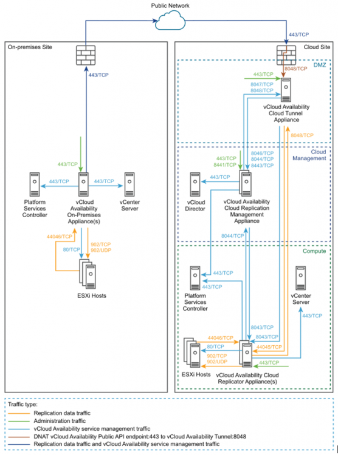

## Overview
  
After deploying and setting up a service provider cloud site, you install and configure a VMware Cloud Director Availability appliance on-premises to enable the replication and the failover capabilities from the on-premises vCenter Server to the cloud and reverse.  

## VMware Cloud Director Availability On-Premises Network Requirements

Before you start deploying and configuring the VMware Cloud Director Availability on-premises appliance, ensure that the required network ports are opened and allow the communication within the on-premises site and the cloud site.

## Network Ports Configuration

The following diagram shows the direction of the data flow, the data traffic type, and the required network ports for the communication between the VMware Cloud Director Availability on-premises appliance and the disaster recovery infrastructure.



## Firewall Rules for the On-Premises Site Communication

The following table lists the required network ports to be opened for the VMware Cloud Director Availability on-premises appliance communication in the-premises site:

| Source | Destination | Port | Protocol | Description |
| ---    | ---         | ---  | ---      | ---         |
| Browser login session | VMware Cloud Availability On-Premises Appliance(s) | 443 | TCP | Used for browser logins to the on-premises appliance |
| VMware Cloud Availability On-Premises Appliance(s) | Firewall       | 443 | TCP | Used for communication to the cloud site |
|                                             | vCenter Server | 443 | TCP | Used for communication to the vCenter Server |
|                                             | Platform Services Controller | 443 | TCP | Used for single sign-on login to the appliance and for vCenter Server Lookup service communication |
|                                             | ESXi Hosts     | 902 | TCP | Used for Transferring replication data from the on-premises appliance to the ESXi hosts |
|                                             |                |     | UDP | |
|                                             |                | 80  | TCP | Used for transferring replication data for the ESXi hosts to the on premises appliance |
| ESXi Hosts | VMware Cloud Availability On-Premises Appliance(s) | 44046 | TCP | - |

## Deployment Requirements

An ESXi host can handle the replication traffic through its management VMkernel interface. You can separate the management traffic from the replication traffic by creating a dedicated replication VMkernel interface. Use the following tags when you create a VMkernel interface for the replication traffic.

- **vSphere Replication** - Use this tag to configure the ESXi host for the outgoing replication traffic.
- **vSphere Replication NFC** - Use this tag to configure the ESXi host for the incoming replication traffic.

You configure the replication VMkernel interface in its own IP subnet and connect the VMware Cloud Director Availability on-premises appliance to the same virtual port group. With this configuration, the replication traffic between the ESXi hosts and the VMware Cloud Director Availability Replicator instances stays in the same broadcast domain. As a result, the replication traffic does not cross a router uncompressed and saves the bandwidth.

The the VMware Cloud Director Availability on-premises appliance services perform a host name certificate verification. In the VMware Cloud Director certificate, the **CommonName** or at least one of the entries in the **Subject Alternative Name** must match the VMware Cloud Director FQDN or IP that you use when registering VMware Cloud Director.

## Deploy an On-Premises VMware Cloud Director Availability Appliance by Using the vSphere Client

In the vSphere Client, you can deploy an on-premises VMware Cloud Director Availability appliance by using a single OVA file.

1. Log in to your vCenter Server by using the vSphere Client.

1. Navigate to a target object where you want to deploy the on-premises VMware Cloud Director Availability appliance.  

    !!! note

        As a target object you can use a data center, a folder, a cluster, a resource pool, or a host.

1. Right-click the target object and from the drop-down menu select **Deploy OVF Template**.  
    (The **Deploy OVF Template** wizard opens.)

1. On the **Select an OVF template** page, browse to the `VMware-vCloud-Availability-OnPrem-release\_number-xxx-build\_number\_OVF10.ova` file location and click **Next**.

1. On the **Select a name and folder** page, enter a name for the on-premises appliance, select a deployment location, and click **Next**.

1. On the **Select a compute resource** page, select a host, or cluster as a compute resource to run the appliance on, and click **Next**.

1. On the **Review details** page, verify the OVF template details and click **Next**.

1. On the **License agreements** page, select the **I accept all license agreements** check box and click **Next**.

1. On the **Select storage** page, select the virtual disk format and the storage policy for the appliance and click **Next**.

1. On the **Select networks** page, optionally configure the network settings, then click **Next**.

1. On the **Customize template** page, customize the deployment properties of the on-premises appliance and click **Next**.

    1. Enter and confirm the initial password for the appliance **root** user.
        You must change the initial **root** user password when you log in for the first time.

    1. **(Required)** Select the **Enable SSH** check box.

    1. In the **NTP Server** section, enter the NTP server address for the appliance to use.

        !!! warning
        
            Ensure that vCenter Server, ESXi, VMware Cloud Director, Platform Services Controller, and the VMware Cloud Director Availability appliance all use the same NTP server.

1. On the **Ready to complete** page, review the settings, optionally select **Power on after deployment** and to begin the OVA installation process, click **Finish**.

1. The Recent tasks pane shows a new task for initialising the OVA deployment. After the task is complete, the new appliance is created on the selected resource.

## Deploy an On-Premises VMware Cloud Director Availability Appliance by Using the OVF Tool

In the OVF Tool console, you can deploy an on-premises VMware Cloud Director Availability appliance by using a single OVA file. You define deployment parameters in the OVF Tool console and run the deployment script.

1. Log in to a server where the OVF Tool is running, by using a Secure Shell (SSH) client.

1. Define deployment parameters in the OVF Tool console by running the following commands.

    ``` bash
    # VMNAME="Name-to-be-Assigned-to-the-VM"
    # VSPHERE_DATASTORE="vSphere-datastore"
    # VSPHERE_NETWORK="VM-Network"
    # OVA="local_client_path/VMware-vCloud-Availability-OnPrem-release_number-xxx-build_number_OVF10.ova"
    # VSPHERE_USER="vCenter-Server-admin-user"
    # VSPHERE_USER_PASSWORD="vCenter-Server-admin-user-password"
    # VSPHERE_ADDRESS="vCenter-Server-IP-address"
    # VSPHERE_LOCATOR="vSphere-locator"
    ```

1. Deploy an on-premises VMware Cloud Director Availability appliance.

    The following example script deploys a VMware Cloud Director Availability appliance on-premises and sets a static IP address.

    ``` bash
    # echo $VMNAME
    #./ovftool/ovftool --name="${VMNAME}" --datastore="${VSPHERE_DATASTORE}" --acceptAllEulas --powerOn --X:enableHiddenProperties --X:injectOvfEnv --X:waitForIp --ipAllocationPolicy=fixedPolicy --machineOutput --noSSLVerify --overwrite --powerOffTarget "--net:VM Network=${VSPHERE_NETWORK}" --diskMode=thin --prop:guestinfo.cis.appliance.root.password='Your-Root-Password' --prop:guestinfo.cis.appliance.ssh.enabled=True --prop:guestinfo.cis.appliance.net.ntp='Your-ntp-server-ip-address' --prop:vami.DNS.VMware_vCloud_Availability='Your-DNS-Server-Address' --prop:vami.domain.VMware_vCloud_Availability='Your-Domain-Name' --prop:vami.gateway.VMware_vCloud_Availability='Your-Gateway-IP-Address' --prop:vami.ip0.VMware_vCloud_Availability='IP-to-be-Assigned-to-the-Appliance' --prop:vami.netmask0.VMware_vCloud_Availability='Your-Netmask-Address' --prop:vami.searchpath.VMware_vCloud_Availability='Your-Search-Path-Address' "${OVA}" "vi://${VSPHERE_USER}:${VSPHERE_USER_PASSWORD}@${VSPHERE_ADDRESS}${VSPHERE_LOCATOR}"
    ```

The console outputs the IP address of the VMware Cloud Director Availability appliance.  

## Configure the On-Premises VMware Cloud Director Availability Appliance

To configure the on-premises appliance, you change the initial **root** user password that you set during the OVA deployment and register the on-premises appliance with a vCenter Server Lookup service.

1. In a Web browser, navigate to **https://_On-Prem-Appliance-IP-address_/ui/admin**.

1. Log in by using the **root** user password that you set during the OVA deployment.  
    (The **Appliance Password** window opens.)

1. Change the initial **root** user password.

    1. Enter the initial **root** user password set during the OVA deployment.

    1. Enter and confirm a new password.  
        Create a secured password with a minimum of eight characters and containing at least one of each of the following characters:  
        - Lowercase: a b c  
        - Uppercase: A B C  
        - Numeric: 1 2 3  
        - Special: & # %

    1. Click **Apply**.  
        The **Getting Started** tab opens.

1. Click **Run initial setup wizard**.  
    (The **Initial Setup** wizard opens.)

1. On the **Site Details** page, enter a **Site Name**, optionally enter a **Site Description**, and click **Next**.

1. On the **Lookup service details** page, enter **lookup-service-IP-address**, **single sign-on** user credentials, and click **Next**.

1. Accept the SSL certificate of the vCenter Server Lookup service and click **Next**.

1. On the **Cloud Details** page, pair the on-premises VMware Cloud Director Availability appliance and the cloud organization.

    1. Enter the VMware Cloud Director Availability Public API endpoint address.

    1. Enter the VMware Cloud Director **user@org** user credentials.

    1. **(Optional)** Select **Allow Access from Cloud**.  
    By selecting this option you allow the cloud provider and the organization administrators to perform the following operations from the VMware Cloud Director Availability Portal without authenticating to the on-premises site.
        - Discover on-premises workloads and replicate them to the cloud.  
        - Reverse existing replications to the on-premises site.
        - Replicate cloud workloads to the on-premises site.  
        By leaving this option deselected, only users authenticated to the on-premises VMware Cloud Director Availability Portal can configure new replications and existing replications cannot be reversed from the VMware Cloud Director Availability Portal.

    1. Accept the SSL certificate of the VMware Cloud Director Availability Public API endpoint and click **Next**.

1. You can optionally join the **VMware Customer Experience Improvement Program**, confirm your choice, and click **Next**.

1. On the **Ready to complete** page, optionally select to configure local placement and complete the initial setup wizard by clicking **Finish**.

    1. You can configure data center to cloud replications, by leaving **Configure local placement now** deselected.  
    1. To enable cloud to data center replications, select **Configure local placement now**.  

    !!! note

        For more information, see [Configure Local Placement](https://docs.vmware.com/en/VMware-vCloud-Availability/3.0/com.vmware.vcav.onprem.install.config.doc/GUID-80604012-1A63-41DA-BA4E-935168A4C2B5.html#GUID-80604012-1A63-41DA-BA4E-935168A4C2B5).

1. The on-premises VMware Cloud Director Availability appliance is configured and after you log in to the VMware Cloud Director Availability vApp Replication Manager appliance and navigate to**Sites**, you can see both cloud and on-premises sites available.  

## What to do next

If you skipped configuring local placement in the initial wizard, you can do that next.