## Overview

VMware VMware Cloud Director Availability 3.0 (vCAV) is a single interface for **workload migration**, **cloud-to-cloud disaster recovery**, and **on-premises disaster recovery**. VMware Cloud Director availability is a Disaster Recovery-as-a-Service (DRaaS) solution.

## How VMware Cloud Director Availability Works

**vCAV** is a single appliance that deploys all the services required to operate between an on-premises and the AUCyber environment. It integrates into the on-premises vCenter and connects to the VMware Cloud Director environment and corresponding vCAV appliance through a tunnel node. It provides three core functionalities:

- Migrating virtual machines from and to your on-premises vCenter.
- Protect on-site virtual machines to the VMware Cloud Director environment.
- Protect workloads on your VMware Cloud Director environment by replicating them to your on-prem environment.

All of this is managed through a single interface, VMware Cloud Director Availability 3.0.

## VMware Cloud Director Availability - Tenant Requirements

The following table lists the Firewall rules required to enable replication from the replication source to AUCyber.

| Source | Destination | Port | Protocol | Description |
| ---    | ---         | ---  | ---      | ---         |
| Browser login session | VMware Cloud Availability On-Premises Appliance(s) | 443 | TCP | Used for browser logins to the on-premises appliance |
| VMware Cloud Availability On-Premises Appliance(s) | Firewall       | 443 | TCP | Used for communication to the cloud site |
|                                             | vCenter Server | 443 | TCP | Used for communication to the vCenter Server |
|                                             | Platform Services Controller | 443 | TCP | Used for single sign-on login to the appliance and for vCenter Server Lookup service communication |
|                                             | ESXi Hosts     | 902 | TCP | Used for Transferring replication data from the on-premises appliance to the ESXi hosts |
|                                             |                |     | UDP | |
|                                             |                | 80  | TCP | Used for transferring replication data for the ESXi hosts to the on premises appliance |

No network changes are required on the client side. You initiate all traffic from the on-premises site, meaning all traffic flows outbound. Thus, the interface does not require a DNAT rule for tunnel traffic. A regular SNAT is enough.

## Tenant Deployment Process

1. Deploy vCAV On-Premises Appliance

1. Complete the vCAV Configuration Wizard

1. Configure Protection Replication

## Deploy vCAV On-Premises Appliance Using vSphere Client

The tenant deployment process is like all typical VMware OVF deployments. The tenant must install the **VMware Cloud Director Availability On-Premises Appliance OVA** into the **vCenter** they would like to replicate to and/or from. Once deployed, the on-premises appliance is a single vApp that has three roles:

- **Replication Engine.** Replicates a backup.
- **Tunnel Node.** This will connect your on-prem vCenter directly with the VMware Cloud Director environment.
- **User Interface (UI).** Once you finish the configuration wizard, the UI plugin will be loaded into your vCenter on-prem environment.

Prior to deploying the appliance, AUCyber will provide you with three pieces of information:

- The tunnel endpoint
- Account credentials
- Organization name

### Steps to Deploy

1. Go to [VMware](https://customerconnect.vmware.com/downloads/details?downloadGroup=VCDAT-46&productId=1439) and download the OVA. The file contains all binaries for the VMware Cloud Director Availability appliance.

1. Once downloaded, log into your **vSphere Client**.

1. Navigate to the resource where you plan to deploy the vCAV appliance. The resource can be a data centre, cluster, folder, host, or a resource pool.

1. Right-click on the resource and select **Deploy OVF template** from the drop-down menu. The deployment wizard has **nine steps**.

1. **Select an OVF template.** Opt to install from a local file. Browse to the location of the previously downloaded OVA. Select the vCAV OVA file and click **Next**.

1. **Select a name and folder.** Type in your desired virtual machine (appliance) name. Next, select a location for your virtual machine.

1. **Select a compute resource.** Choose a host or a cluster the appliance will run on. Click **Next** and wait for the system to validate. Whenever replicating VMs to the on-prem environment, vCAV will be using the resource you select now.

1. **Review details.** This is a chance for you to evaluate and verify the template.

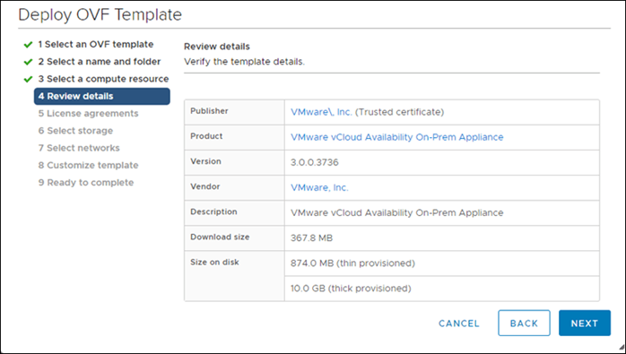

1. License agreement. Check the I accept all license agreements checkbox and click Next.

1. Configuration. In this case, you are deploying an on-premises appliance. Thus, make sure you select the On-Prem Appliance option.

1. Select storage. Configure optional storage options for the deployment.

1. Select networks. Choose a destination network for every individual source network.

1. Customize template. During this step of the wizard, customize the deployment.

- **Root Password.** Defining a root password is mandatory. However, you will need to change it when you log in to vCAV for the first time. You do not need to define a very strong password at this point.
- **Enable SSH.** Select the **Enable SSH** checkbox (mandatory)
- **NTP Server.** Enter the **NTP server address** the vCAV appliance will use. vCenter Server, ESXi, VMware Cloud Director, Platform Services Controller, and the VMware Cloud Director Availability appliance **MUST** all use the same NTP server.

	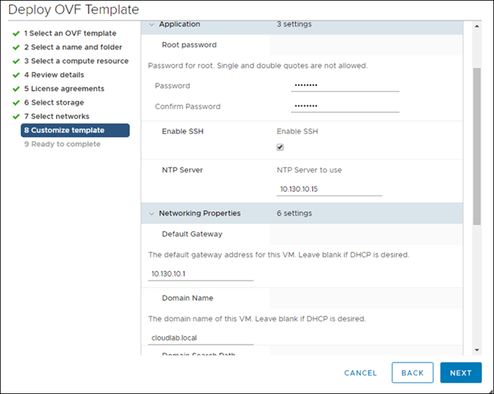

1. **Ready to complete.** Review the settings. Optionally, select to **Power on after deployment.** Click **Finish** to deploy the appliance.

1. Track the progress of the deployment under **Recent Tasks** at the bottom of your screen.

## Complete vCAV Configuration Wizard

The appliance is deployed now. However, you still need to **configure vCAV**:

1. Log in to your vCAV appliance at `https://your-appliance-IP/ui/admin`. Use the root password defined during OVA deployment.

1. **Change the root password**. Set and confirm a new password. Create a strong password with at least eight (8) characters. Make sure to use lowercase, uppercase, numeric, and special characters.

1. To get started, you need to configure a **Lookup Service** endpoint. To do so, select **Run Initial Setup Wizard**.

1. Once the **Initial Setup** window opens, start with the first page in the navigation pane.

1. **Site Details**. In it, type your **Site** **Name** and optionally a short **Description** about the site. Click **Next**.

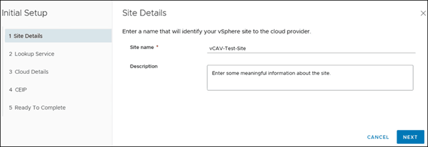

1. In the **Lookup Service** tab, enter your connection details to set up the lookup service along with SSO admin credentials.

- **Lookup service address.** Enter your Replication Source lookup service address. For example: `https://{servername}:443/lookupservice/sdk`
- Enter SSO admin account credentials in the **Username** and **Password** field

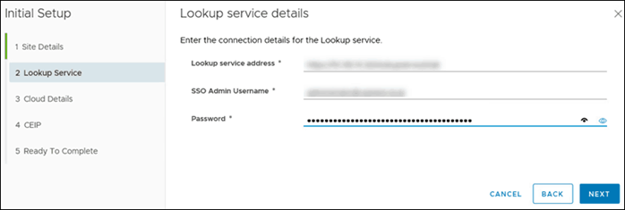

1. Click **Next** and accept the SSL certificate of the vCenter Server Lookup to continue.

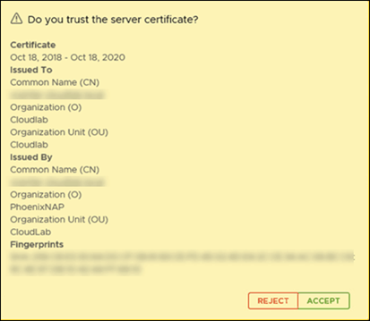

h. Proceed to the configure **Cloud Details** by pairing up your on prem and AUCyber sites.

i. Define the Public API Endpoint: [https://vcav.sz101.australiacloud.com.au:443](https://vcav.sz101.australiacloud.com.au/)

j. Configure your organization’s credentials for logging in to the cloud site. Type in **Organization** **Admin** (e.g.: username@organization-name)  and the corresponding **Password** as provided by AUCyber.

k. **Optional**: Select **Allow Access from** Cloud. If you **select** this feature, the cloud provider and organization administrators can access and perform certain operations through the **VMware Cloud Director Availability Port**. Without authenticating to the on-premises site, users can:

- Discover on-premises workloads and replicate them to the cloud.
- Reverse existing replications to the on-premises site.
- Replicate cloud workloads to the on-premises site.

l. If you leave this feature **deselected**, configuring new replications will only be accessible to users authenticated to the on-premises VMware Cloud Director Availability Portal. Additionally, no existing replications will be reversed from the Portal.

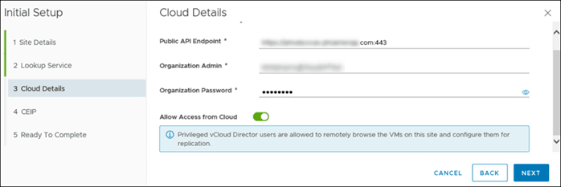

m. Click **Next** and accept the SSL certificate for VMware Cloud Director Availability Public API endpoint.

n. Decide whether you want to participate in the **VMware Customer Experience Improvement Program** (CEIP). To join, confirm your choice, and click **Next**.

o. Move on to **Ready to Complete** and confirm details provided in previous steps are accurate.

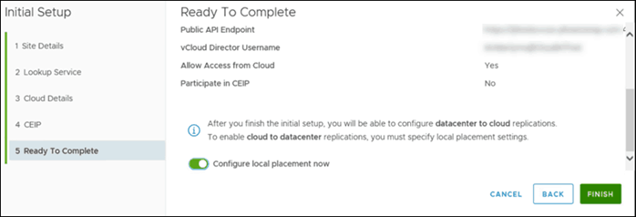

p. Check **Configure local placement now** to enable cloud to datacentre replications. Leaving the box unchecked requires additional set up to configure the replications.

q. Click **Finish** to complete the initial setup.

***Configure Local Placement**

When the **configure local placement now** checkbox is ticked, the **Configure placement** wizard will open immediately after the Initial setup is completed.

a. Select a location for storing the recovered virtual machines

b. Select a compute resource for the recovered virtual machines at the destination site

c. Choose which network the virtual machines connect to after their failover

d. Select a datastore for the replicated virtual machines.

e. Review the settings and click **Finish** to complete the configuration.

f. To view the summary, expand the **placement** window

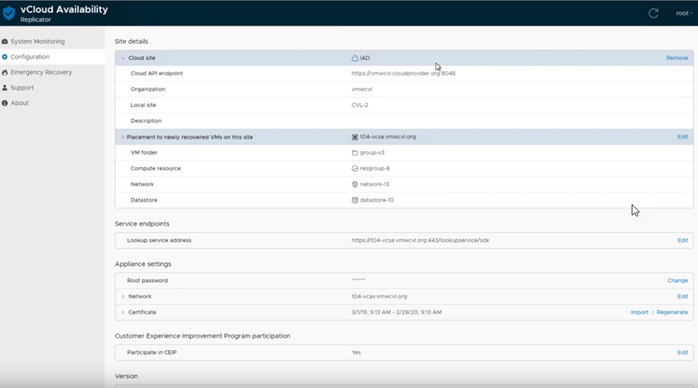

***Configure Replications**

**Replication** is the process of copying a virtual machine (VM) from one location to another. The first replication creates a copy at a remote location, after which the replicated VM is updated according to a predefined schedule to match the source VM.

There are two types of replication:

- **Incoming replications**
- **Outgoing replications**

**Incoming Replications**

Configure incoming replications to secure a remote workload by replicating it to the local VMware Cloud Director location. Such replications run on a remote site, protected at the local vCD location.

**Outgoing Replications**

Configure outgoing replications to secure a local workload by replicating it to a remote site (on-prem or VMware Cloud Director). Outgoing replications run on a local site, protected at the remote location.

**How to Configure Incoming Replication**

After deployment, you can configure local replications. This process is required if you want to replicate **from** the cloud **to** the local vCenter or use the **reverse** replication after a failover.

a. Log in to the **AUCyber Portal**, enter VMware Cloud Director, click on the hamburger button and then on **Availability**.

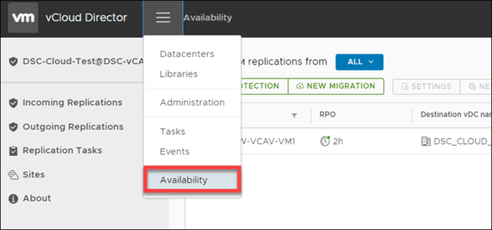

b. Navigate to **Incoming Replications** page and click on **from On-Prem**. Here, you can configure protection for on-premises VMs.

c. Click on **New Protection**. The **New Incoming Replication** window will appear.

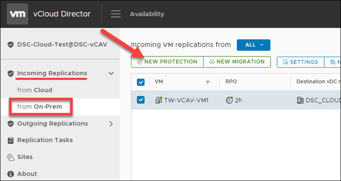

d. In it, you first need to define the **Source Site**, which is the on-premises site owning the vApps and VMs you want to replicate. Click **Next.**

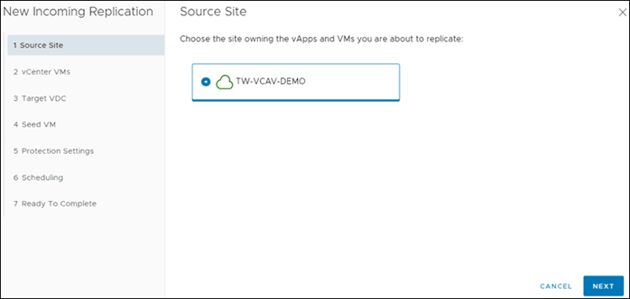

e. Select the VMs you want to protect by checking the corresponding box(es). To continue, click **Next**.

f. Move on to selecting the **Target VDC**.

g. On the page **Seed VM,** choose whether you want to seed. This option is only available if the VMs and VApps marked to be replicated already have an older copy on the target site. The older version is then used as a seed to speed up data transfer.

h. Configure the **Protection Settings** by establishing your:

1. **RPO** – Target Recovery Point Objective. The RPO will determine the maximum data loss that you can tolerate.
1. **Storage policy** – As per storage selected
1. **Retention policy** – How many instances you want to preserve over a time period, evenly
1. **Enable Quiesce** – Ensure application-level consistency prior to creating an instance

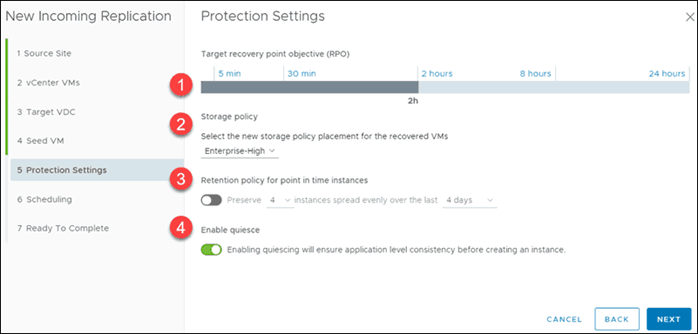

i. Once you define protection settings, continue to **Scheduling**. Here, check if you want to start synchronization **Immediately** or **At a specific time**. Then, click **Next**.

j. On the final page, **Ready to Complete**, verify settings and click **FINISH**.

**How to Configure Outgoing Replications**

a. Outgoing replications are configured in the same way as incoming replications.

**Reviewing the State of Existing Replications**

You can review the state and details of all on-premises incoming replications. With the interface, you can see all the information concerning the configuration for replicating, information on the source and destination, as well as the health of the workload.

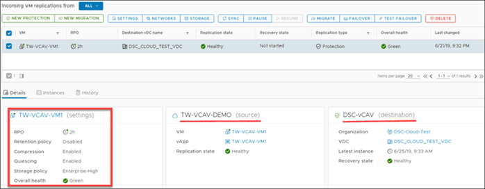

**Performing a Test Failover**

With test failover tasks, you can verify whether the data from the source is replicated correctly on the target site. The replication Data is deleted once the Test Failover has been performed.

a. In the VMware Cloud Director Availability Portal, either form the **Incoming Replications** or from the **Outgoing Replications** pane, select the protected vApp that you want to test.

b. Click Test Failover.

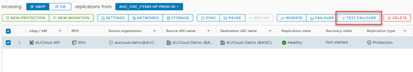

c. The Test Failover wizard opens

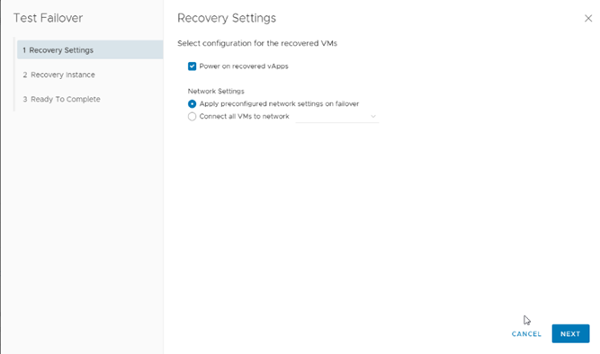

d. On the **Recovery Settings** page, use the options to configure the test task and click **Next**.

e. On the Recovery Instance page, configure the recovery point in time and click **Next.**

f. On the Ready to Complete page, review the test details and click **Finish** to initiate the Test Failover Task.

g. You can monitor the progress in the **Replications Task** pane.

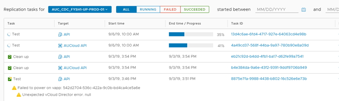

**Conducting the Test Cleanup**

a. From the **Incoming Replications** or the **Outgoing Replications** pane, you can conduct the test          cleanup.

b. From the replications pane, select the test failover you want to cleanup

c. Select **Test Cleanup**

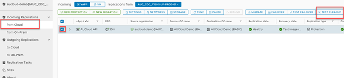

d. Click **CLEANUP**

**Deleting Replications**

a. You can remove the replication by selecting the vApp or VM and clicking **Delete.**

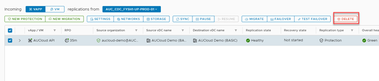

b. Confirm you wish to delete the selected replication by clicking **DELETE**
