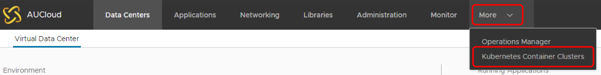

## Overview
This document is aimed to provide AUCyber tenancy administrators an overview on how to delete a kubernetes cluster within VMware Cloud Director.

Following the steps outlined in this document will delete a Kubernetes cluster.

## Prerequisites
Before a cluster is able to be deleted from the VCD WebUI, all *load balancers* and *Persistent Volumes (PV)* **must** be manually removed/detached from the cluster via the `Kube Config`.

## Deleting a cluster

1. From a VCD tenancy, Select **More** > **Kubernetes Container Clusters**.

    

2. Select the radio select for the cluster you wish to delete.  Click the **Delete** button to start the upgrade process.

    
	
	This can also be done by clicking on the link of the cluster's name and viewing the status page as shown below:
	
	

3. The **Delete Cluster** menu will show relevant warnings about the deletion.  Review these and click **Delete**.

    

    !!! warning "Force Delete"

        **Force Delete** should only be used on any cluster in an incomplete or unremovable state.  This will remove associated resources, ie VMs, Persistent Volumes (Shared Disks), Load balancer(s).  However, manually checking these resources and removing manually maybe required.

4. There will be confirmation page that the deletion request was acknowledged.  Click **Close**.

    

5. The Kubernetes menu will show the status of the cluster under as **Deleting**.

	

6. Under the VCD **Recent Tasks** you will notice a Virtual Machine with the name *EPHEMERAL_TEMP_VM(...)* creating and powering on.  This VM will orchestrate the deletion of the Kubernetes cluster.  Please allow up to an hour, depending on the size of the cluster, for this process to complete.

	

7. The deletion is completed once the K8 nodes and Ephemeral VM have all been deleted.

	