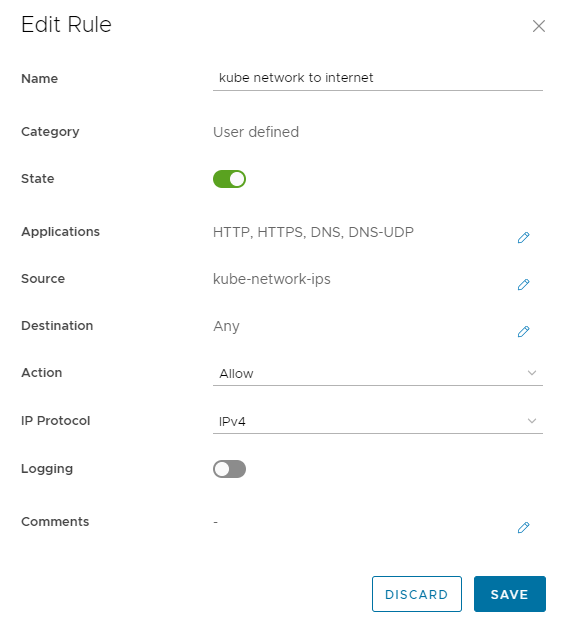
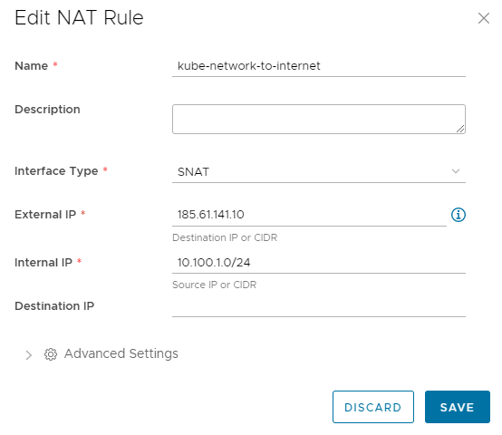

## Overview
This document is aimed to provide AUCloud tenancy administrators an overview on the prerequisites that are required to be setup before a Kubernetes cluster can be deployed.

The below prerequisites *must* be completed before [Provisioning clusters from the VMware Cloud Director UI](./provisioning_clusters_vcd_ui.md)

- Account that has Organisation Administrator access to VCD tenancy
- Create **Routed Network**
    - **Firewall rule** to allow access to internet resources.
    - **NAT rule** to allow access to internet resources.
- External IP address or internal one on the specified routed network (at least one).  This is required for the Control Plane IP (virtual server, VIP) used to administer the Kubernetes cluster.

### OrgVDC Network

It is recommended to create a dedicated **Routed Network** to deploy Kubernetes nodes to.  Creating multiple **Routed Networks** for different Kubernetes clusters is also recommended.

Please see our [Create a Routed VDC Network](../Compute/NSX-T_Networks/create_a_routed_vdc_network/) guide.

### Edge Gateway

For full Edge Gateway guide please see [Edge Services Gateway](../Compute/NSX-T_Networks/edge_services_gateway.md)

The below Firewall & NAT rules are required for the deployment of the Kubernetes Clusters.  The deployment of the Kubernetes clusters is run from a temporary VM that is created within the tenancy and requires access to [VMware Github CSE repository](https://github.com/vmware/container-service-extension) for deployment scripts.

#### Firewall Rules

| Setting | Value |
| :-- | :-- |
| Name | *Enter a name for this rule* |
| State | **Enabled** |
| Applications | 53/UDP (DNS) 53/TCP (DNS) 80/TCP (HTTP) 433/TCP (HTTPS) |
| Source | Security group created from either Static Groups or IP Sets that contains the OrgVDC network/IPs that Kubernetes nodes are deployed on |
| Destination | **Any** |
| Action | **Allow** |
| IP Protocol | **IPv4** |
| Logging | *not required* |
| Comments | *not required* |

#### NAT Rules

| Setting | Value |
| :-- | :-- |
| Name | *Enter a name for this rule* |
| Description | *Optional: description for this rule* |
| Interface Type | **SNAT** |
| External IP | *External IP address on the Edge Gateway* |
| Internal IP | *Internal IP(s) or CIDR of internal kube network* |
| Destination IP | **Leave blank** |

## Kubernetes Control Plane IP

It is best to plan what Control Plane IP address will be used by the Kubernetes cluster before you deploy the cluster.  This IP address can be an external IP (public) that is hosted on the tenancy's Edge Gateway. This IP address will be inserted into the `KUBECONFIG` file, and therefore `kubectl` commands (see [kube config](./obtaining_kube_config.md)) will use the IP access the Kubernetes cluster to control settings.

If *no* Control Plane IP is specified during the provisioning wizard, then an IP on the Edge Gateway's external IP range will be used. Cluster creation will fail if there are no free external IPs available.

When specifying an internal IP it needs to be a free IP on a **routed network** that is connected to the Edge Gateway in the OrgVDC that the Kubernetes cluster is deployed to.

The Control Plane IP is setup as **Virtual Service** under the Edge Gateway's Load Balancer settings.