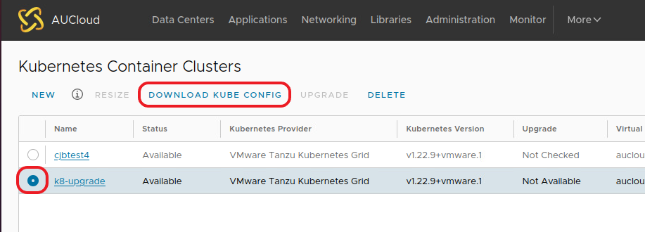
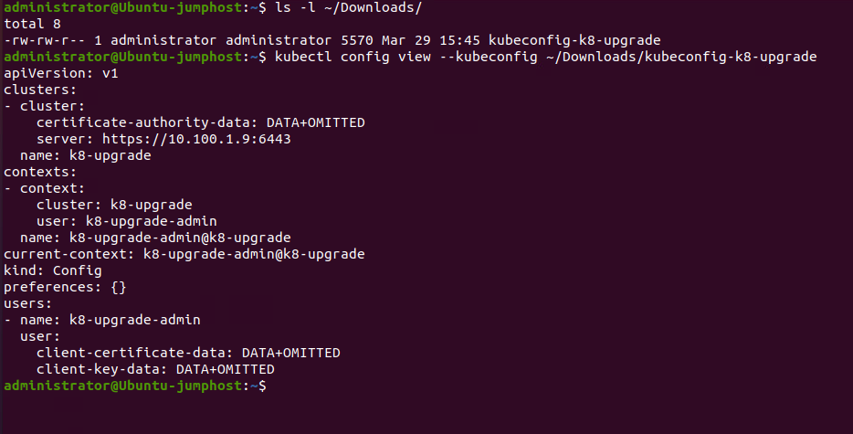
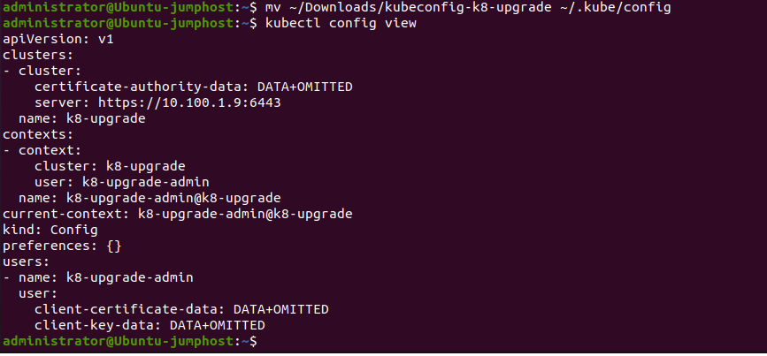

## Overview

This document will show the basic steps to interact with a Kubernetes Cluster via the `kubectl` tool.

## `kubectl` tool

To be able to interact with your Kubernetes Cluster you will require the `kubectl` tool.  This is the official tool from Kubernetes and is available for multiple Operating Systems.

- Install guides for all OS (Linux/MacOS/Windows): https://kubernetes.io/docs/tasks/tools/

- Reference: https://kubernetes.io/docs/reference/kubectl/

## Download kube config from VCD plug-in UI

1. Download via plugin example

    

2. Once downloaded you can view the configuration via the `kubectl` command:

    

3. If you move this file into the default kube configuration file location `~/.kube/config` as below, this file will be used as the default environment when issuing a `kubectl config view` command:

    

    Access to multiple Kubernetes configuration files can be setup with the use of the `KUBECONFIG` environment variable, please refer to the Kubernetes documentation [Configure Access to Multiple Clusters](https://kubernetes.io/docs/tasks/access-application-cluster/configure-access-multiple-clusters/)


## Test that `kubeconfig` works

!!! note "Presumes API endpoint is accessible"
    Your VDC must be setup to allow network access from your workstation to your cluster API endpoint over port 6443

Given correct setup at a minimum you should be able to test basic visibility. `kubectl get nodes` should give you the list of your nodes including control planes nodes. e.g.

```bash
kubectl get nodes
NAME                                          STATUS   ROLES                  AGE    VERSION
mycluster-control-plane-node-pool-cf7nr         Ready    control-plane,master   3d3h   v1.22.9+vmware.1
mycluster-worker-node-pool-1-5c95f5cc68-67jb4   Ready    <none>                 3d3h   v1.22.9+vmware.1
mycluster-worker-node-pool-1-5c95f5cc68-g5kxv   Ready    <none>                 3d3h   v1.22.9+vmware.1
mycluster-worker-node-pool-1-5c95f5cc68-rsx22   Ready    <none>                 3d3h   v1.22.9+vmware.1
```


