## Overview
This document is aimed to provide AUCyber tenancy administrators an overview on how to deploy a kubernetes cluster within VMware Cloud Director.

Following the steps outlined in this document will create a Kubernetes cluster consisting of: three control plane nodes; a single worker node; and a load balancer configured to present the kubernetes (control plane) API.

### Prerequisites

!!! Warning "Mandatory"
    The below prerequisites are *required* to be in place before you can provision a Kubernetes cluster.  Networking details are outlined in more details under [Kubernetes Networking Prerequisites](./kubernetes_networking.md).

- Account that has Organisation Administrator access to VCD tenancy
- Create **Routed Network**
    - **Firewall rule** to allow access to internet resources.
    - **NAT rule** to allow access to internet resources.
- External IP address or internal one on the specified routed network (at least one).  This is required for the Control Plane IP (virtual server, VIP) used to administer the Kubernetes cluster.

### Reference Material

Official Kubernetes documentation on [Components](https://kubernetes.io/docs/concepts/overview/components) and [Viewing Pods and Nodes](https://kubernetes.io/docs/tutorials/kubernetes-basics/explore/explore-intro/).

## Create a cluster

1. From a VCD tenancy, Select **More** > **Kubernetes Container Clusters**.

    

2. Select **NEW**.

    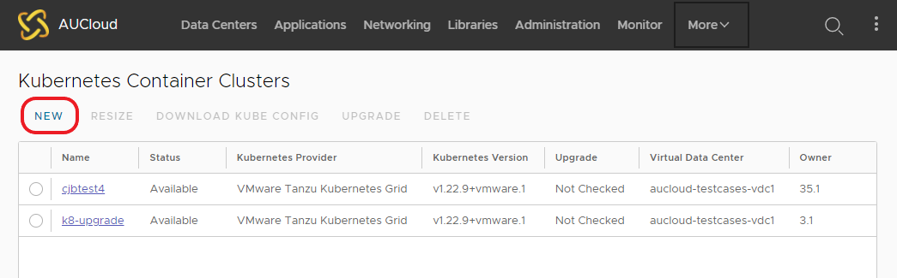

3. Select **VMware Tanzu Kubernetes Grid** as the Kubernetes runtime for the cluster.

    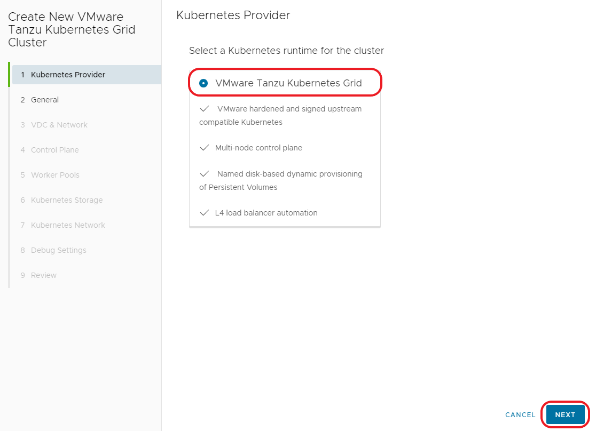

4. Name the Cluster, and select the version of Kubernetes.

    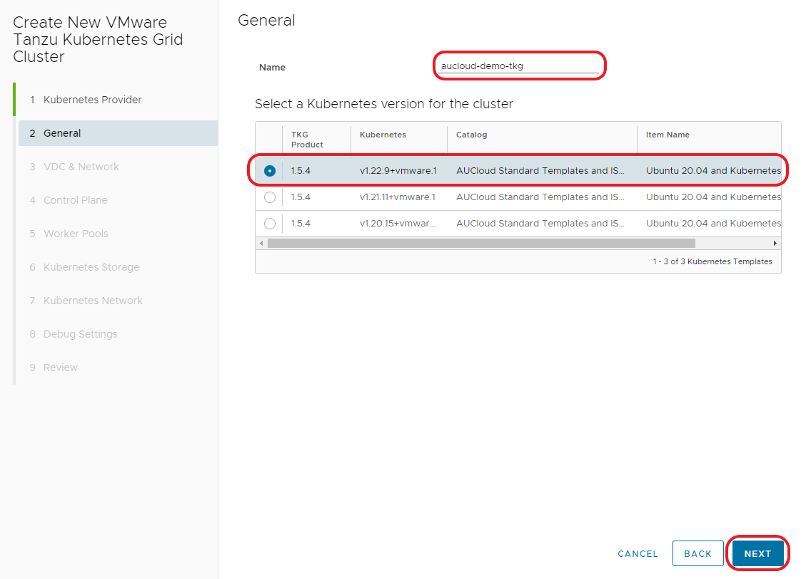

5. Select the Virtual Data Center (VDC) and Network for the new cluster.

    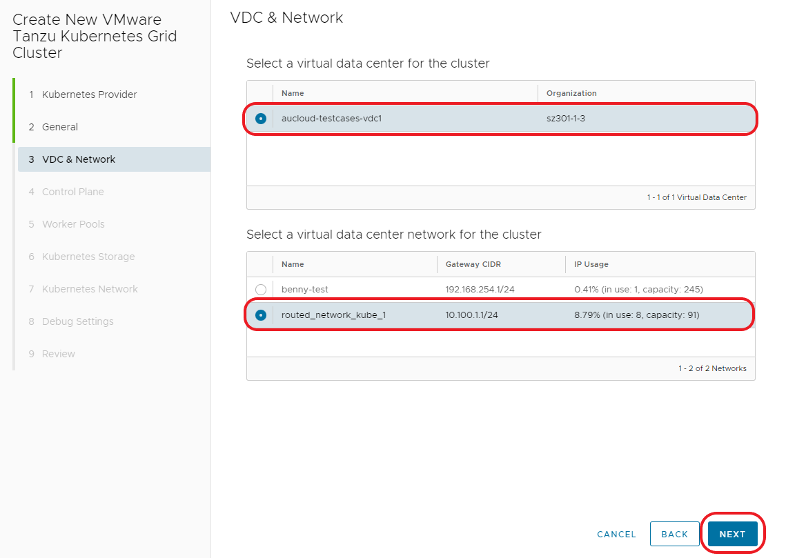

6. Configure **Control Plane** settings.

	- **Sizing Policy** you MUST select one of the TKG prefixed policies.  This table shows the size of the nodes deployed
	
	| TKG Policy Name | vCPU | Memory GB |
	| :-------------- | ---- | --------- |
	| TGK extra-large | 8    | 32        |
	| TGK large       | 4    | 16        |
	| TGK medium      | 2    | 8         |
	| TGK small       | 2    | 4         |

	- **Storage Policy** should be your default VM Policy, ie *Performance*

    !!! note
        Best practice is at least 3 nodes for the control plane to provide redundancy for ETCD.
        
        Further information about AUCyber's node sizing, please see [AUCyber KubernetesCluster sizing guide](./cluster_sizing_guide.md).
        
        For more information about kubernetes control planes, please see [Kubernetes Components](https://kubernetes.io/docs/concepts/overview/components)

    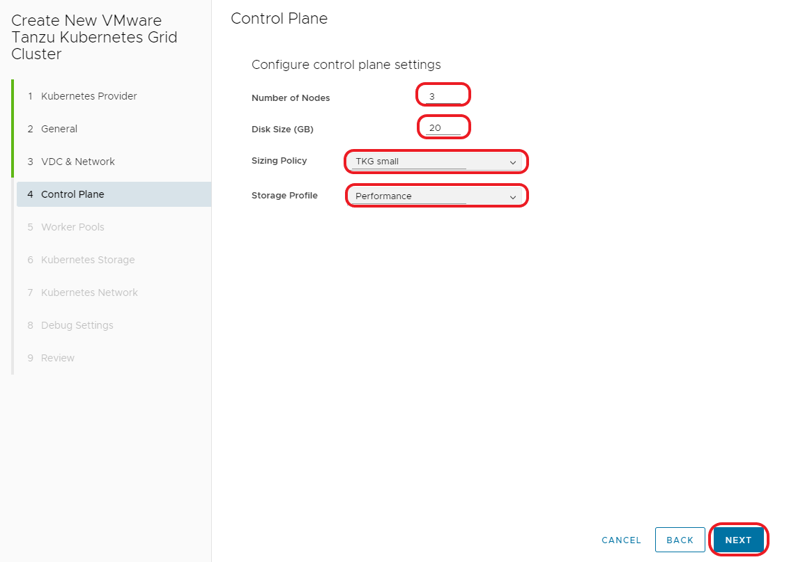 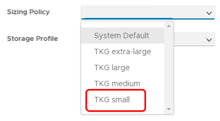

7. Configure **Worker Pools**.

	- **Sizing Policy** you MUST select one of the TKG prefixed policies.  Please see sizing table in previous Step 6 above.

	- **Storage Policy** should be your default VM Policy, ie *Performance*

    !!! note
	
		If your application requires HA please add additional nodes and also consider creating a placement policy for redundancy.  

    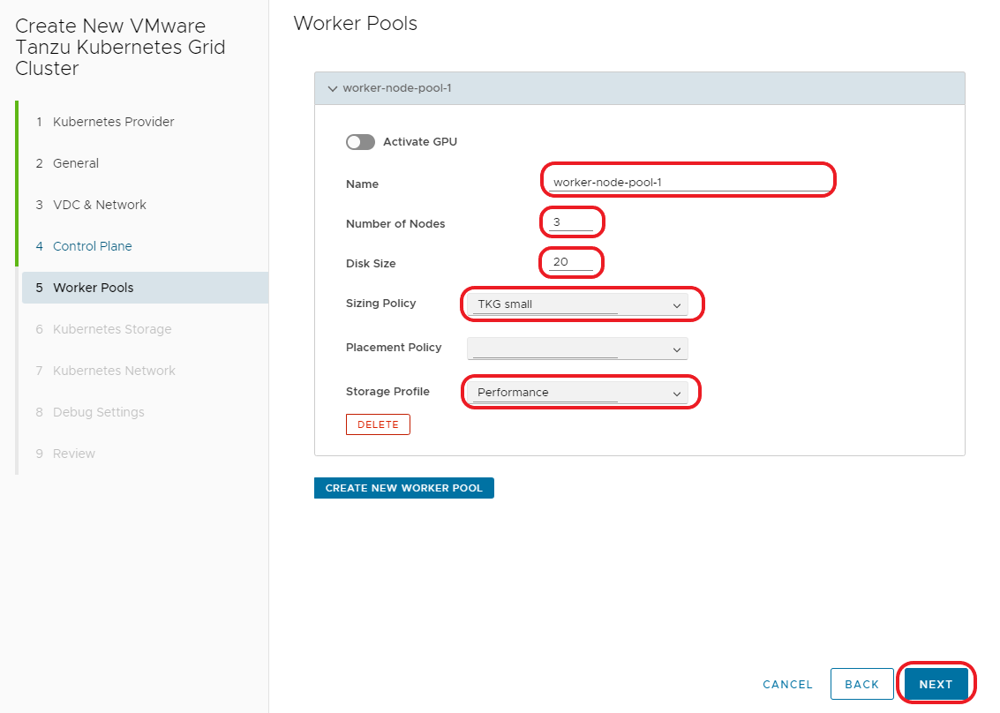

    For more information about kubernetes worker nodes please see [Viewing Pods and Nodes](https://kubernetes.io/docs/tutorials/kubernetes-basics/explore/explore-intro/)

8. Configure Kubernetes Storage.

	- Kubernetes utilizes shared disks to communicate between worker nodes. The **Shared Named Disks** storage policy has been enabled to allow this integration with VMware Cloud Director via Named Disks. Failure to use the **Shared Named Disks** storage profile could lead to, performance degradation, corruption or complete data loss.

    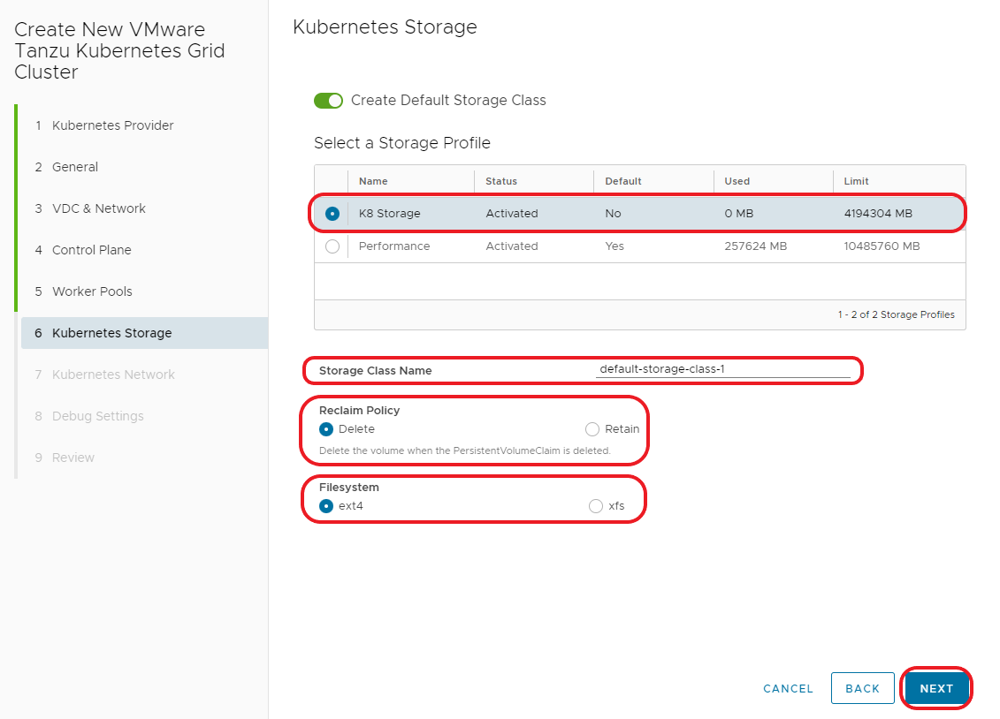

9. Configure the **Kubernetes Networks**.
	
	- Default Kubernetes CIDRs are usually fine.
	
	- **Control Plane IP (optional)** - If you do not specify an (internal) IP address for the control plane (example: 192.168.0.200/24) the cluster IP for the control plane will utilize the limited amount of external IP address. If all external IPs are already used, the cluster creation process will fail.

    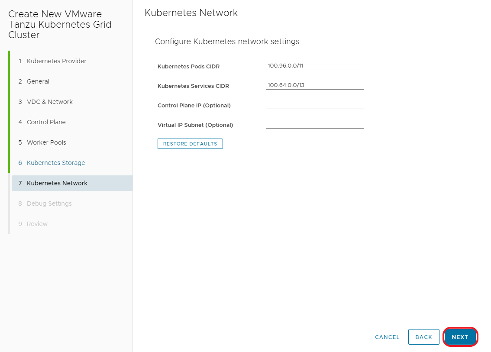

10. Leave the **Auto Repair on Errors** enabled.

    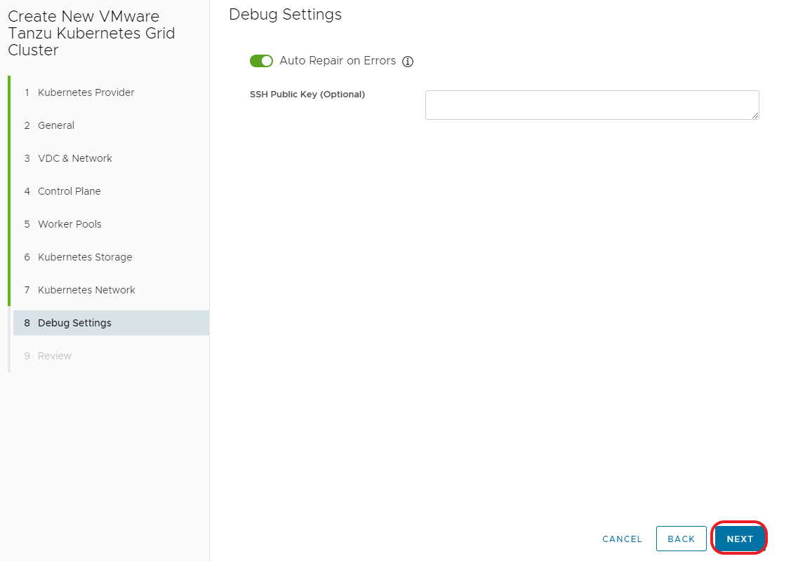

11. **Review** and take note of the warning around the API token.

    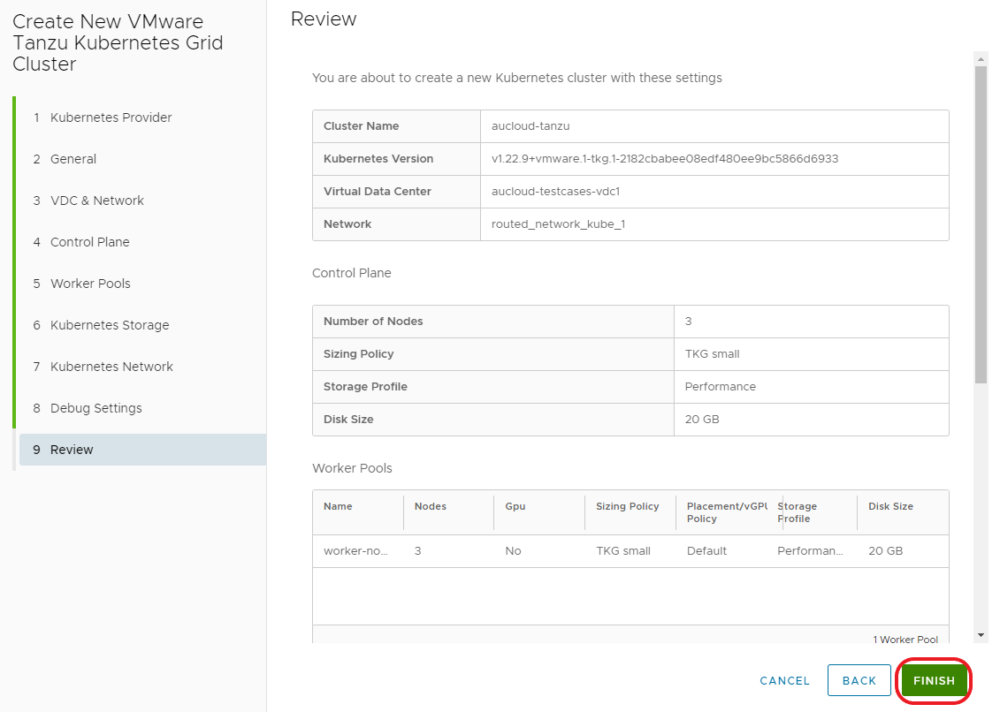
