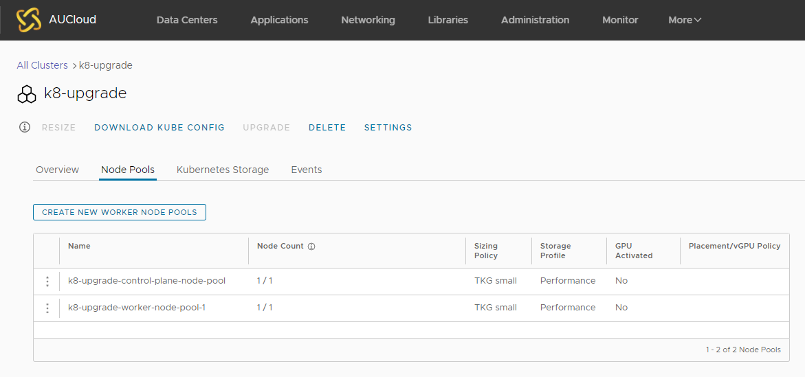
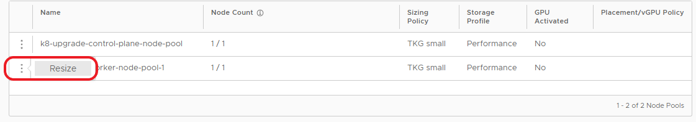
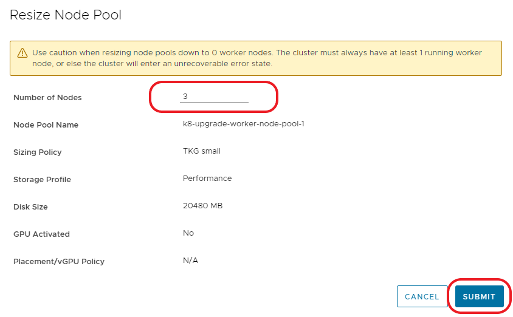
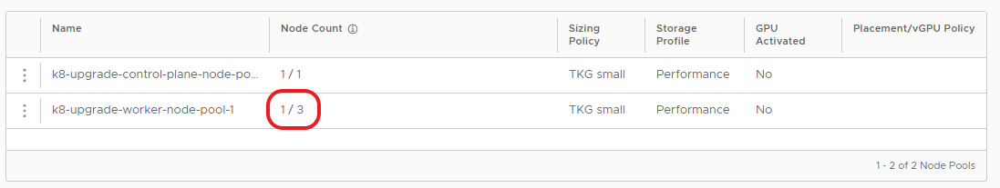
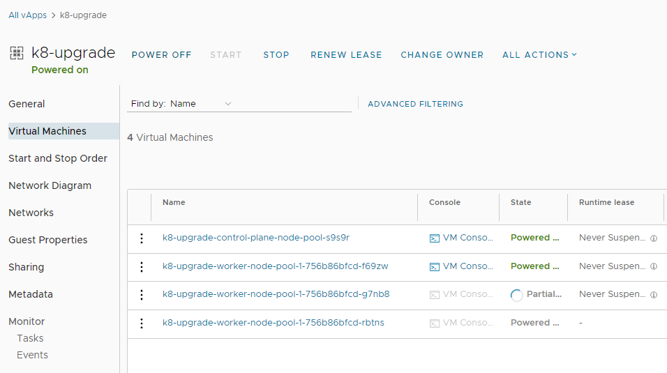
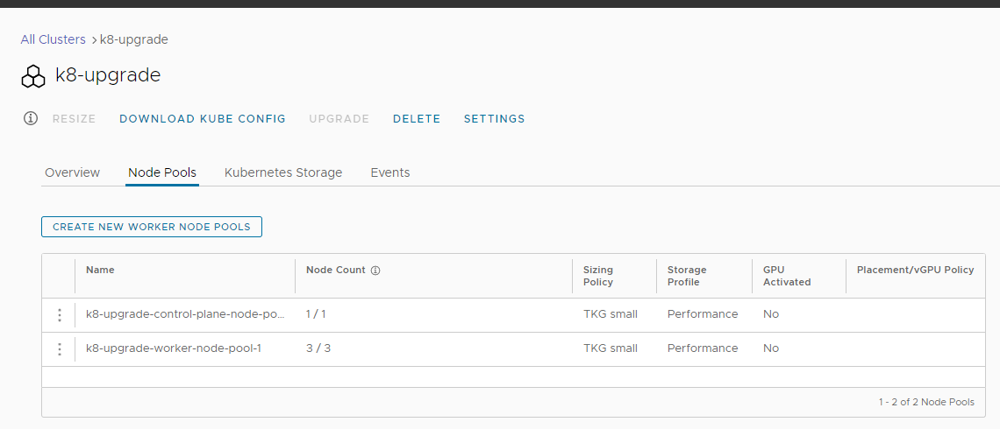

## Overview
This document is aimed to provide AUCyber tenancy administrators an overview on how to resize a kubernetes cluster (Control Plane or Worker Pool) within VMware Cloud Director.

Following the steps outlined in this document will upgrade a Kubernetes cluster.

## Resizing a cluster

1. Open up the Kubernetes cluster that you wish to resize, and go to the **Node Pools** tab

    

2. Click the three dots next to the pool that will be resized and click **Resize**

    

3. Change the **Number of Nodes** to the desired value and click **Submit**

    

4. When checking the **Node Pools** tab of the cluster settings you will see the new number of the required nodes.

    

5. It will take a few minutes for the new nodes to deploy or be destroyed.  You can see these changes under the vApp details for the cluster

    

6. The resizing will take some time and will be completed once the **Node Pools** tab on the Kubernetes cluster shows the correct **Node Count**.

    

