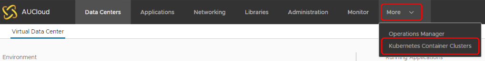
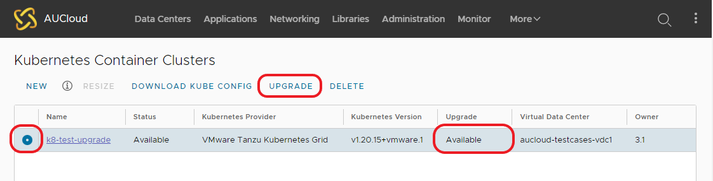
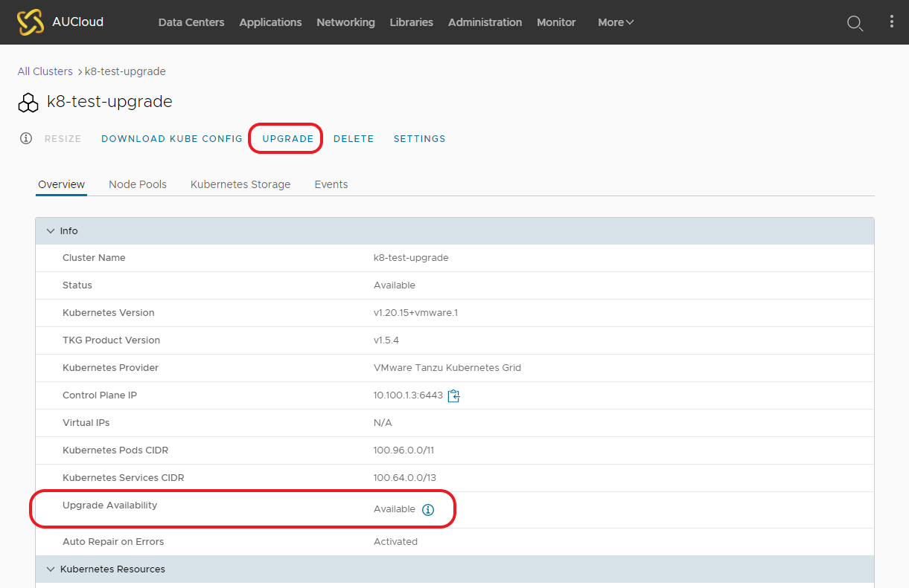
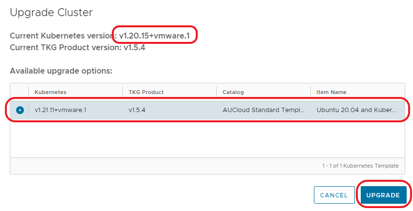
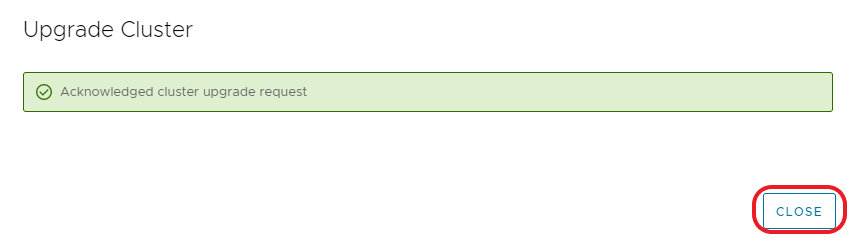
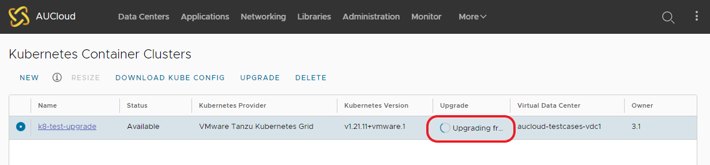
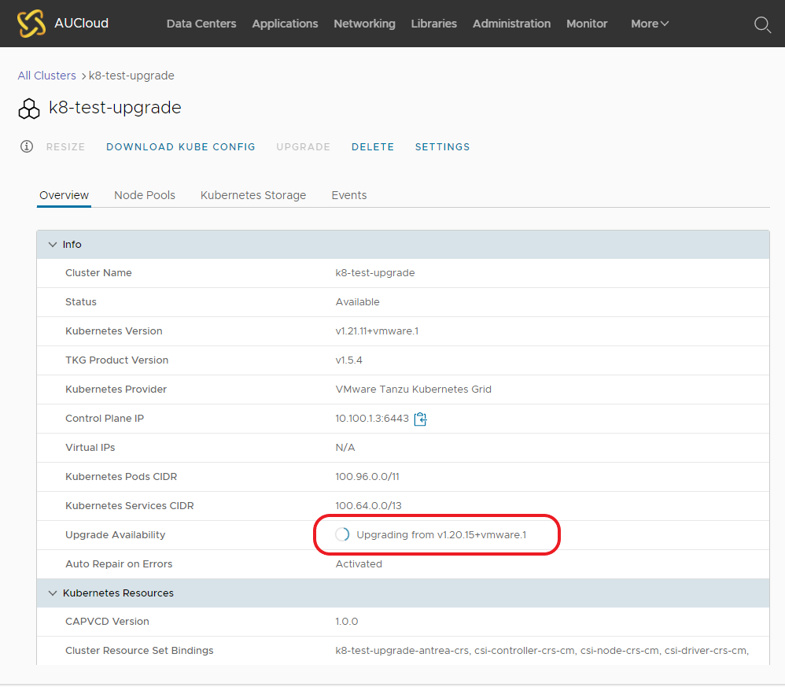
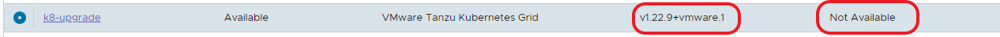

## Overview
This document is aimed to provide AUCloud tenancy administrators an overview on how to upgrade a kubernetes cluster within VMware Cloud Director.

Following the steps outlined in this document will upgrade a Kubernetes cluster.

## Upgrading a cluster

1. From a VCD tenancy, Select **More** > **Kubernetes Container Clusters**.

    

2. Select the radio select for the cluster you wish to upgrade and the **Upgrade** column will start an assessment if an upgrade is available.  Once the assessment is finished the status of *Available* will be shown in this column.  If an upgrade is *Available*, the **Upgrade** button across the top menu will be available.  Click the **Upgrade** button to start the upgrade process.

    
	
	This can also be done by clicking on the link of the cluster's name and viewing the status page as shown below:
	
	

3. The **Upgrade Cluster** menu will show the cluster's current version and available versions to upgrade to.  Select the version to upgrade to and click **Upgrade**.

    

4. There will be confirmation page the the upgrade process has started.  Click **Close**.

    

5. The Kubernetes menu will show the progress status of the upgrade under in the **Upgrade** column.

	

	This can also be view within the 'details' page of the cluster in the VCD UI.

    

6. Once the kubernetes cluster has been upgraded, you will see the new version listed under the **Kubernetes Version** and the **Upgrade** column will show *Not Available*

	