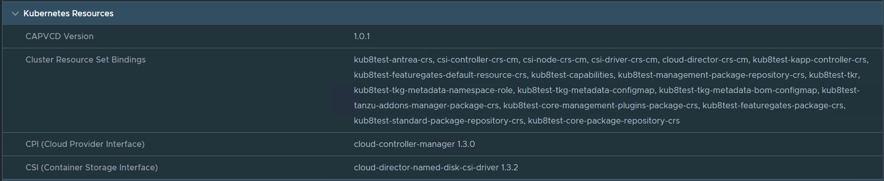

## Overview

This document is aimed to provide AUCloud tenancy administrators an overview on how to upgrade kubernetes components within VMware Cloud Director (VCD).  
To see how to upgrade a Kubernetes cluster version please see [here](./upgrading_clusters_vcd_ui.md)

## Upgrading Tanzu Kubernetes components

Tanzu Kubernetes relies on components to communicate with VMware Cloud Director (VCD), these should be upgraded where possible to patch the provider.    
To view the current versions of Tanzu Kubernetes for VCD and component versions and see the following link [here](./kubernetes_versions.md)  

### View component versions via GUI (vcd web)  

  VCD > More > Kubernetes Container Clusters > select the cluster and expand Kubernetes Resources

  

### View component versions via CLI

While connected to your Kubernetes cluster perform the following commands and verify the version  
If you have multiple clusters you can specify individual config files within the command to save time `--kubeconfig=< path to kubeconfig >` after `kubectl` example of CAPVCD below.  

```bash

#example using --kubeconfig
kubectl --kubeconfig=< path to kubeconfig > get deployment -n capvcd-system capvcd-controller-manager -o=jsonpath={.spec.template.spec.containers[*].image}

```

### Cloud Provider for VCD (CAPVCD)  

`capvcd-system capvcd-controller-manager`
  
  ``` bash
  
  kubectl get deployment -n capvcd-system capvcd-controller-manager -o=jsonpath={.spec.template.spec.containers[*].image}

  ```

  ```bash

  #output
  projects.registry.vmware.com/vmware-cloud-director/cluster-api-provider-cloud-director:1.0.0

  ```

### Cluster API Provider (CPI)

`kube-system vmware-cloud-director-ccm`  

  ``` bash
  
  kubectl get deployment -n kube-system vmware-cloud-director-ccm -o=jsonpath={.spec.template.spec.containers[*].image}

  ```

  ```bash
    
  #output
  projects.registry.vmware.com/vmware-cloud-director/cloud-provider-for-cloud-director:1.2.0

  ```

### Container Storage interface driver (CSI)

`kube-system csi-vcd-nodeplugin`

  ``` bash

  kubectl get DaemonSet -n kube-system csi-vcd-nodeplugin -o=jsonpath={.spec.template.spec.containers[*].image}

  ```

  ```bash
  
  #output
  k8s.gcr.io/sig-storage/csi-node-driver-registrar:v2.2.0
  projects.registry.vmware.com/vmware-cloud-director/cloud-director-named-disk-csi-driver:1.3.0

  ```

## Upgrading Tanzu components **CLI ONLY**

### Cloud Provider for VCD (CAPVCD)

`capvcd-system capvcd-controller-manager``

```bash

kubectl patch deployment -n capvcd-system capvcd-controller-manager -p '{"spec": {"template": {"spec": {"containers": [ {"name": "manager", "image": "projects.registry.vmware.com/vmware-cloud-director/cluster-api-provider-cloud-director:1.0.1"}]}}}}'

```

### Cluster API Provider (CPI)

`kube-system vmware-cloud-director-ccm`

``` bash

kubectl patch deployment -n kube-system vmware-cloud-director-ccm -p '{"spec": {"template": {"containers": [{"name": "vmware-cloud-director-ccm", "image": "projects.registry.vmware.com/vmware-cloud-director/cloud-provider-for-cloud-director:1.3.0"}]}}}'

```

### Container Storage interface driver (CSI)

`kube-system csi-vcd-nodeplugin`

``` bash

kubectl patch StatefulSet -n kube-system csi-vcd-controllerplugin  -p '{"spec": {"template": {"spec": {"containers": [{"name": "vcd-csi-plugin", "image": "projects.registry.vmware.com/vmware-cloud-director/cloud-director-named-disk-csi-driver:1.3.2"}, {"name": "csi-attacher", "image": "registry.k8s.io/sig-storage/csi-attacher:v3.2.1"}, {"name": "csi-provisioner", "image": "registry.k8s.io/sig-storage/csi-provisioner:v2.2.2"}]}}}}'
kubectl patch DaemonSet -n kube-system csi-vcd-nodeplugin -p '{"spec": {"template": {"spec": {"containers": [{"name": "vcd-csi-plugin", "image": "projects.registry.vmware.com/vmware-cloud-director/cloud-director-named-disk-csi-driver:1.3.2"}, {"name": "node-driver-registrar", "image": "registry.k8s.io/sig-storage/csi-node-driver-registrar:v2.2.0"}]}}}}'

```
