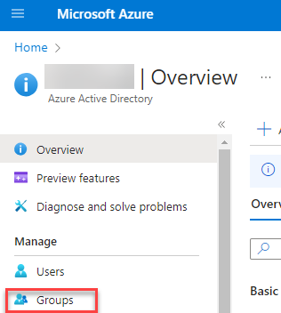
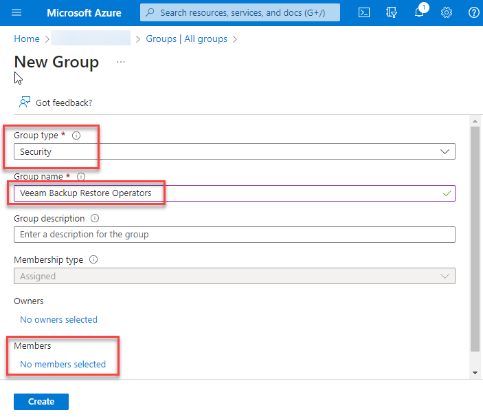

**Adding an Azure Security Group to control Restore Operators**

It is suggested to create an **Azure Group** where AUCyber can configure the **group** to have Restore Operator privileges. This way; customers can control the members of the group through their Azure Active Directory.

Please follow the below instructions to set this up:

- Navigate to     portal.azure.com and sign in.
- Click on Entra ID (formerly known as Active Directory)
- Click on [Groups](https://portal.azure.com/#view/Microsoft_AAD_IAM/ActiveDirectoryMenuBlade/~/Groups)
       

- Click **New Group**
  - **Type**: Security Group
  - **Name**: Veeam Backup Restore      Operators
  - **Members**: add any users you      wish to have restore operator privileges

**Let your Customer Success Manager know the name of the group you create and configuration can be finalised.**
