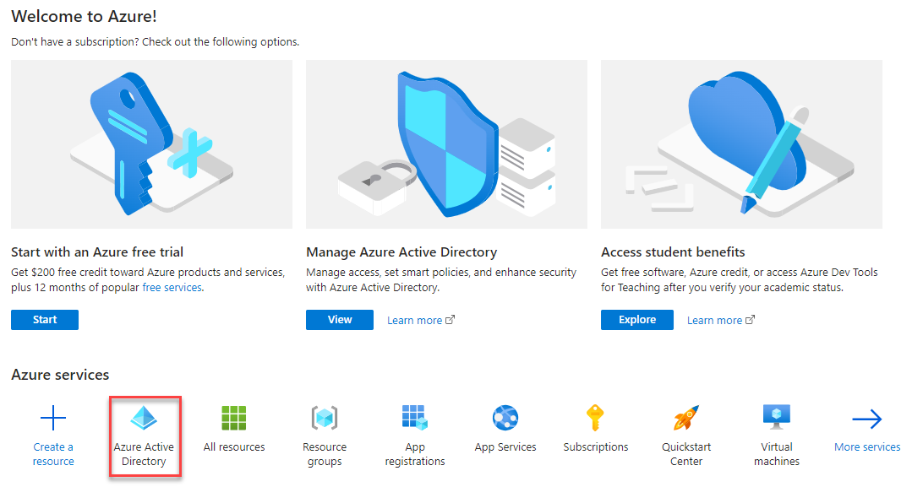
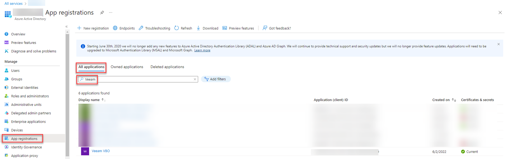
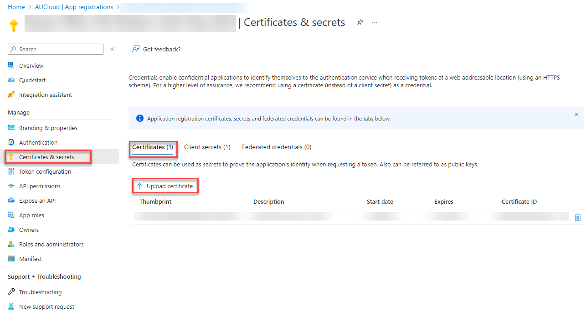
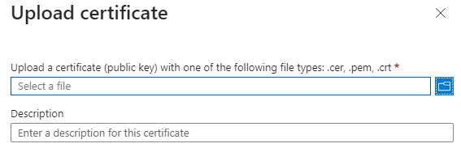

## Overview 

This guide outlines the steps required to upload a new public key (certificate) to your Microsoft 365 tenancy to ensure the correct functioning of your AUColoud M365 Backup Solution. As an AUCloud M365 backup customer, you will be provided with a public key during your initial onboarding. Throughout the duration of your M365 backup service, your public key will expire annually. AUCloud will reach out to you with a new public key prior to expiry, and request that you update your public key using these instructions.

## Upload a New Certificate (Public Key)

1. Log in to the **Azure Portal** with your tenancy details

    

2. At the **Welcome** Screen, select **Azure Active Directory**

    

3. Go to **App registrations** for the organisation's tenancy. Click on **All applications** and search for **Veeam** (or application name if different). Select the appropriate Veeam backup application.

    

4. Once in the application, go to **Certificates and secrets**. Click on **Certificates**There should be at least one certificate uploaded already. These are the certificates that are about to expire. Click on **Upload certificate**

    

5. When the prompt below opens, select the public key that AUCloud has provided from your local folder. Enter a description such as "Veeam O365 backup certificate".

    

6. On the **Ready to Complete** page, review your selected settings and click **Finish**.

7. Your certificate should now be uploaded successfully and your backup jobs will continue to run as normal. 
8. **Please confirm with AUCloud once this step has been completed so we can finalise the back-end updates for the new certificate**
