## Information on how to configure your M365 tenant for AUCyber's M365 Backup as a Service

This guide outlines the steps required to configure and implement your Microsoft 365 Backup with AUCyber
using the modern app-only authentication method. Backup and restore both authenticate with a certificate
against a Microsoft Entra ID application registered in your tenant, so you never share a password or
an app password with AUCyber. Veeam Backup for Microsoft 365 does still need the username of one
account in your tenant when your organisation is added. You will be allocated a Customer Success
Manager (CSM) who will assist you with the on-boarding process, provide advice and act as a conduit
to deeper technical support when required.

## Prerequisites

- Customers must have a Microsoft 365 account that has an active subscription.
- One Microsoft 365 user account in your tenant. Veeam Backup for Microsoft 365 asks for its username when your organisation is added, and uses the account for Exchange impersonation. Any account in the tenant will do, and you give AUCyber the username only, never a password. If your backup includes public folder mailboxes, the account also needs an active mailbox, an Exchange Online licence and Owner permission on the public folders.
- The account used for configuration must have permission to manage applications in Microsoft Entra ID (formerly Azure Active Directory). Any of the following Entra ID roles include the required permissions:

    * [Application administrator](https://learn.microsoft.com/en-us/entra/identity/role-based-access-control/permissions-reference#application-administrator)
    * [Application developer](https://learn.microsoft.com/en-us/entra/identity/role-based-access-control/permissions-reference#application-developer)
    * [Cloud application administrator](https://learn.microsoft.com/en-us/entra/identity/role-based-access-control/permissions-reference#cloud-application-administrator)

- Granting tenant-wide admin consent to the application permissions requires a Global Administrator.
- AUCyber will provide you with a certificate (public key) to be used during application registration. This certificate is used to authenticate both backup and restore operations.
- Configuration is performed in the [Microsoft Entra admin center](https://entra.microsoft.com).

!!! note "Public folder mailboxes"

    Grant the Owner permission from Exchange Online PowerShell:

    ```
    $folders = Get-PublicFolder "\" -Recurse
    foreach ($folder in $folders) { Add-PublicFolderClientPermission -Identity $folder.Identity -User <user_account> -AccessRights Owner }
    ```

## Microsoft Entra ID application permissions

### Register an application

1. In the [Microsoft Entra admin center](https://entra.microsoft.com), go to **Identity** > **Applications** > **App registrations**.
1. Select **New registration**.
1. Enter a display **Name** and select **Accounts in this organizational directory
only**.

    !!! note

        The Redirect URI can be left blank.

1. Select **Register** to complete the initial app
registration.

  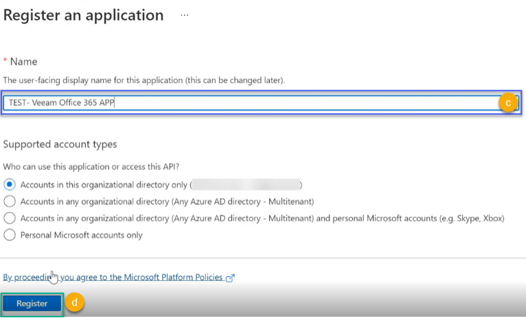


### Grant Global Reader permission

The Global Reader role must be assigned to the application itself. It is required by the
Exchange.ManageAsApp permission to back up public folder and discovery search mailboxes. To grant the
role, do the following:

1. In the [Microsoft Entra admin center](https://entra.microsoft.com), go to **Identity** > **Roles & admins** > **Roles & admins**.

    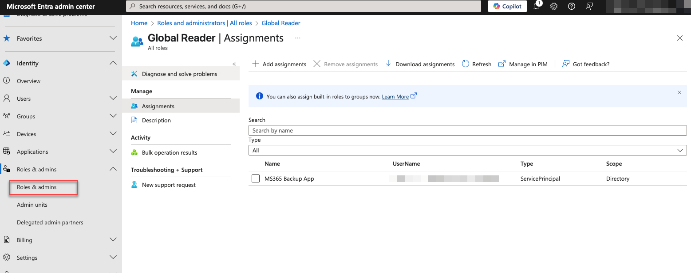

1. In the **Administrative roles** list, find the **Global Reader** role and click on it.
1. In the **Global Reader** window, click **Add assignments**.
1. In the **Select member(s)** section, click the link.
1. In the **Select a member** window, select the application you registered and click **Select**.
1. The selected application appears in the **Selected member(s)** list.
1. Click **Next** and then **Assign** to finish the wizard.

### Configure Application permissions

Select the newly registered application, select **API permissions**, and add permissions for:

- Microsoft Graph
- Office 365 Exchange Online
- Office 365 SharePoint Online

    !!! note

        To search for other APIs, select **APIs my organisation uses**.

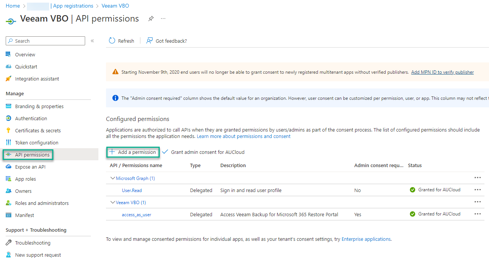

All required permissions are of the **Application** type. Delegated permissions are not required:
restores are performed using the application certificate, not a signed-in user.

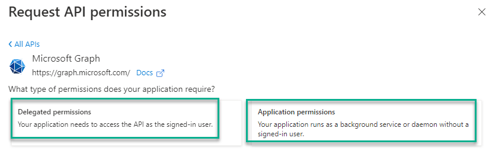

Add every permission listed in both tables on the
[Entra ID Application Permission Requirements](./EntraID_application_permission_requirements.md) page:

1. [Permissions for backup](./EntraID_application_permission_requirements.md#permissions-for-backup)
1. [Permissions for restore](./EntraID_application_permission_requirements.md#permissions-for-restore)

!!! warning "Exchange Web Services (EWS) retirement"

    Microsoft disables EWS in Exchange Online on 1 October 2026. The Microsoft Graph mailbox
    permissions in the tables (User.Read.All, MailboxItem.ImportExport.All, MailboxFolder.ReadWrite.All
    and MailboxItem.Read.All) allow Exchange data to be backed up and restored through the Microsoft
    Graph API instead of EWS. Make sure they are granted, otherwise Exchange backups will fail once
    Microsoft retires EWS.

After all permissions are added, you will need to **grant admin consent**:

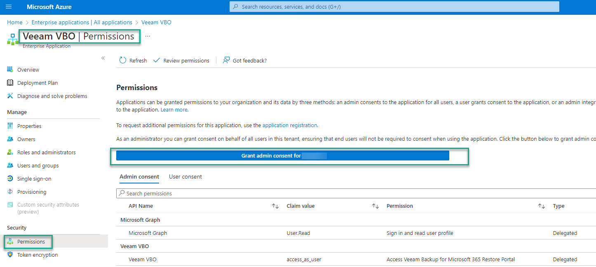

### Add a Certificate (public key)

1. Select **Certificates & secrets > Certificates**.
1. Select **Upload certificate**.
1. Browse for the certificate to be uploaded.

    !!! note

        AUCyber will provide this certificate.

1. Enter a description.
1. Select **Add**.

  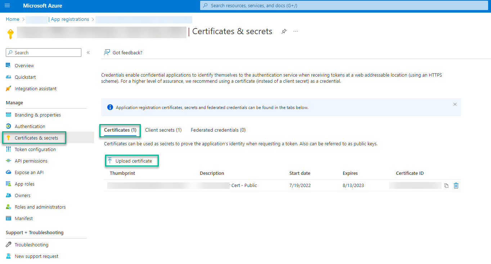

### Join secure meeting with AUCyber

A joint session with the AUCyber technical team is required for you to provide the details needed to
finalise the configuration of the Veeam Backup for Microsoft 365 application. This can be organised via
Webex, Zoom, Teams chat or face-to-face meeting. Please advise your CSM on what suits best.

- Application (client) ID of the registered application
- The username of the Microsoft 365 account from the prerequisites (for example backup@contoso.com)

    !!! note

        If your backup covers SharePoint Online and OneDrive only, Veeam asks for your Microsoft 365
        organisation name (for example contoso.onmicrosoft.com) instead of the username.

  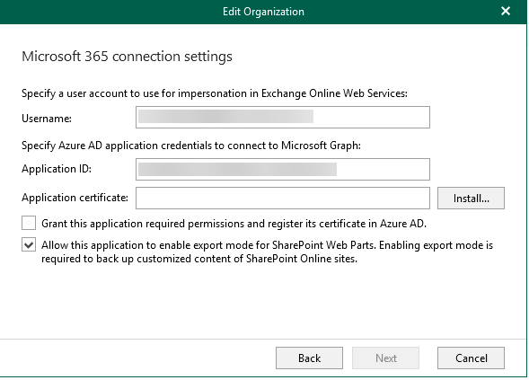

### Restore Portal Access Requirements

To access the Veeam restore portal, you must add an Enterprise Application in Entra ID

#### Prerequisite

For the below, you need to use an account with enough rights to perform an Enterprise Application install on Entra ID. In order to perform these steps, we will need the Microsoft Graph PowerShell module. To install this, open PowerShell and run the following command:

```
Install-Module Microsoft.Graph -Scope CurrentUser -Force
```

!!! note

    You may be prompted to install and import the **NuGet** provider. Please press Y to continue through this.

The next command will connect your PowerShell to Entra ID. Use credentials with admin rights to perform an Enterprise Application install:

```
Connect-MgGraph -Scopes "Application.ReadWrite.All"
```

This will open a traditional username and password Microsoft popup:
Please enter your username and password in this popup including MFA if prompted.

We should see something like this if everything worked smoothly:

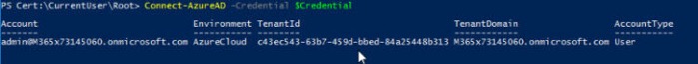

And the final step which brings everything together:

```
New-MgServicePrincipal -AppId "33831092-5ae1-4b51-9eb2-a90033803540"
```

If everything works as expected, the output should show something similar to this:

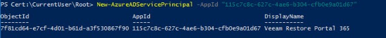

!!! note

    If you receive an error that the application ID already exists, you must delete the pre-existing Enterprise Application 'Veeam VBO' from your Entra ID and then repeat the above command.


**Last-Step - Give permission to the new Application on Entra ID**

- In the [Microsoft Entra admin center](https://entra.microsoft.com), go to **Identity** > **Applications** > **Enterprise applications**, remove the application type filter, and order by created date.

You should see a new Veeam VBO application (the name of the Restore Portal).

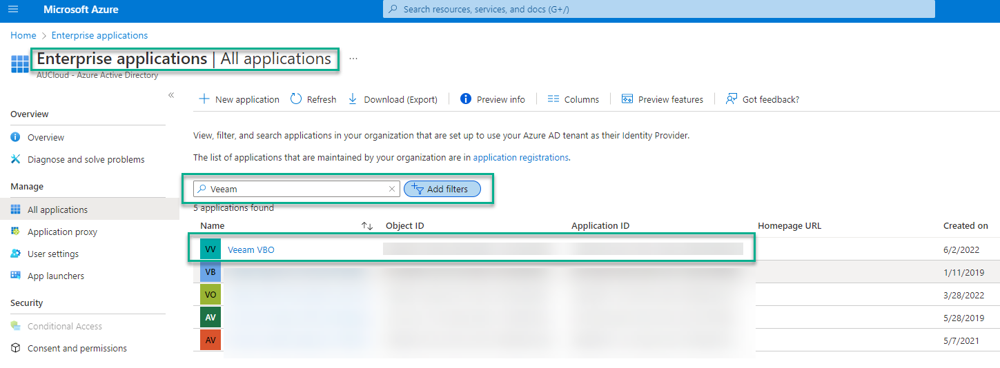

On the Enterprise Application, go to Permissions, and press **Grant admin consent**


That process will ask us again for an authorized account.

We should see something like this:

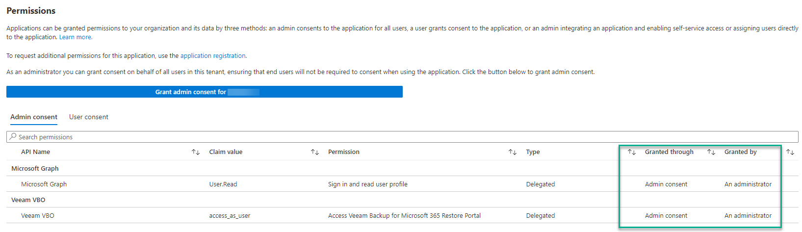

Configuration is completed. You can then proceed to test connectivity to the Restore Portal.

[Restore Portal URLs](../reference_urls.md#veeam-m365-backup-portal)
