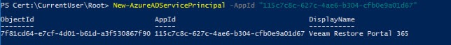

## Information on how to configure your M365 service account for AUCyber's M365 Backup as a Service

This guide outlines the steps required to configure and implement your Microsoft 365 Backup with AUCyber
using the modern authentication method. You will be allocated a Customer Success Manager (CSM) who
will assist you with the on-boarding process, provide advice and act as a conduit to deeper technical support
when required.

## Prerequisites

- Customers must have a Microsoft Office 365 account that has an active subscription.
- The Microsoft Office 365 account used for configuration must have permission to manage applications in Azure Entra ID (formerly known as Active Directory). Any of the following Entra ID roles include the required permissions:

    * [Application administrator](https://docs.microsoft.com/en-us/azure/active-directory/roles/permissions-reference#application-administrator)
    * [Application developer](https://docs.microsoft.com/en-us/azure/active-directory/roles/permissions-reference#application-developer)
    * [Cloud application administrator](https://docs.microsoft.com/en-us/azure/active-directory/roles/permissions-reference#cloud-application-administrator)

- Navigate to [portal.azure.com](https://portal.azure.com) to begin and click on **Azure Entra ID**
- [Create a backup service account](https://learn.microsoft.com/en-us/azure/active-directory/fundamentals/how-to-create-delete-users) in Azure Entra ID (eg. backup@domain.com)
- [Assign roles](https://learn.microsoft.com/en-us/azure/active-directory/fundamentals/users-assign-role-azure-portal) to the service account with the following assignments:

    * Global Reader
    * Exchange Administrator
    * Sharepoint Administrator
    * Teams Administrator

- AUCyber will provide you with a certificate (public key) to be used during application registration.


## Azure Entra ID Application permissions

### Register an application

1. In the Microsoft Office 365 Admin Centre, navigate to **Azure Entra ID**.
1. Under **Manage**, select **App registrations** > **New registration**.
1. Enter a display **Name** and select the **Accounts in this organizational directory
only**.

    !!! note

        The Redirect URI can be left blank.

1. Select **Register** to complete the initial app
registration.

  


### Grant Global Reader permission

To grant the Global Reader role to the Azure AD application, do the following:

3.    Sign in to the Azure portal.

4.    Go to **Microsoft Entra Admin Centre** > **Roles and admins**.

    

5.    In the **Administrative roles** list, find the **Global Reader** role and click on it.

6.    In the **Global Reader** window, click **Add assignments**.

The **Add assignment** wizard runs.

1.    In the **Select member(s)** section, click the link.

2.    In the **Select a member** window, select the Azure AD application in the list and click **Select**.

The selected application appears in the **Selected member(s)** list.

1.    Click **Next** and then **Assign** to finish the wizard.

### Configure Application permissions

Select the newly registered application, select API permissions, and add permissions for:

- Microsoft Graph
- Office 365 Exchange Online
- SharePoint

    !!! note

        To search for other API, select **APIs my organisation uses**.


For each API e.g., Microsoft graph, add the appropriate delegated (restore) and application (backup) type permissions as per below:


  
1. [**Delegated (restore) permissions**](./EntraID_application_permission_requirements.md#permissions-for-restore)

| API      |    Permission Name |  Exchange Online | SharePoint Online and OneDrive for Business | Microsoft Teams | Description |
| ----------- | ----------- | ----------- | ----------- | ----------- | ----------- |
| Microsoft Graph | Directory.Read.All | ✔ | ✔ | ✔ | Querying Azure AD for organization properties, the list of users and groups and their properties.|
| | Group.ReadWrite.All |  |  | ✔ | Recreating in Azure AD an associated group in case of teams restore.|
| | Sites.Read.All |  | ✔ | ✔ | Accessing sites of the applications that are installed from the SharePoint store.|
| | Directory.ReadWrite.All |  |  | ✔ | Setting the preferred data location when creating a new M365 group for a multi-geo tenant in case of teams restore.|
| | Offline Access | ✔ | ✔ | ✔ | Obtaining a refresh token from Azure AD.|
| Office 365 Exchange Online[^1] | EWS.AccessAsUser.All | ✔ |  |  | Accessing mailboxes as the signed-in user (impersonation) through EWS.|
| SharePoint | AllSites.FullControl |  | ✔ | ✔ | Reading the current state and restoring SharePoint sites and OneDrive accounts content.|
|  | User.Read.All |  | ✔ |  | Resolving OneDrive accounts (getting site IDs). Note: This permission is not required to restore SharePoint Online data.|

1. [**Application (backup) permissions**](./EntraID_application_permission_requirements.md#permissions-for-backup)

| API      |    Permission Name |  Exchange Online | SharePoint Online and OneDrive for Business | Microsoft Teams | Description |
| ----------- | ----------- | ----------- | ----------- | ----------- | ----------- |
| Microsoft Graph | Directory.Read.All | ✔ | ✔ | ✔ | Querying Azure AD for organization properties, the list of users and groups and their properties.|
| | Group.Read.Write.All|  | ✔ | ✔ | Querying Azure AD for the list of groups and group sites.|
| | Sites.Read.All |  | ✔ | ✔ | Querying Azure AD for the list of sites and getting download URLs for files and their versions.|
| | TeamSettings.ReadWrite.All |  |  | ✔ | Accessing archived teams.|
| | ChannelMessage.Read.All |  |  | ✔ | Accessing all Teams public channel messages. Note: This permission is only required if you want to back up team chats using Teams Export APIs. For more information, see [Organization Object Types](https://helpcenter.veeam.com/docs/vbo365/guide/vbo_object_types.html#team_chats).|
| Office 365 Exchange Online[^1] |Full Access As App | ✔ |  | ✔ | Reading mailboxes content. |
|  |Exchange.ManageAsApp | ✔ |  |  | 	Accessing Exchange Online PowerShell to do the following: Back up public folder and discovery search mailboxes and determine object type for shared mailboxes as Shared Mailbox. |
| SharePoint | Sites.FullControl.All |  | ✔ | ✔ | Reading SharePoint sites and OneDrive accounts content. |
|  | User.Read.All |  | ✔ | ✔ | Reading OneDrive accounts (getting site IDs). Note: This permission is not used to back up Microsoft Teams data, but you must grant it along with SharePoint Online and OneDrive for Business permission to add Microsoft 365 organization successfully. |

1. After all APIs are added, you will need to **grant admin consent**

   

### Add a Certificate (public key)

1. Select **Certificates & secrets > Certificates**.
1. Select **Upload certificate**.
1. Browse for the certificate to be uploaded.

    !!! note

        AUCyber will provide this certificate.

1. Enter a description.
1. Select **Add**.

  

### Join secure meeting with AUCyber

A joint session with the AUCyber technical team is required for you to enter the necessary credentials to finalise the configuration of the Veeam Backup for Office 365 application. This can be organised via Webex, Zoom, Teams chat or face-to-face meeting. Please advise your CSM on what suits best.

- Service account username
- Application ID

  

### Restore Portal Access Requirements

To access the Veeam restore portal, you must add an Enterprise Application in Azure AD

#### Prerequisite

For the below, you need to use a Service Account with enough rights to perform an Enterprise Application install on Entra ID. In order to perform these steps, we will need the Entra ID PowerShell cmdlet. To install this, open PowerShell and run the following command:

```
Install-Module -Name AzureAD
```

!!! note

    You may be prompted to install and import the **NuGet** provider. Please press Y to continue through this.

The next command will connect your PowerShell to AzureAD. Use credentials with admin rights to perform an Enterprise Application install:

```
Connect-AzureAD 
```

This will open a traditional username and password Microsoft popup:
Please enter your service account username and password in this popup including MFA if prompted.

We should see something like this if everything worked smoothly:


And the final step which brings everything together:

```
New-AzureADServicePrincipal -AppId "33831092-5ae1-4b51-9eb2-a90033803540"
```

If everything works as expected, the output should show something similar to this:



!!! note

    If you receive an error that the application ID already exists, you must delete the pre-existing Enterprise Application ‘Veeam VBO’ from your Azure AD and then repeat the above command.


**Last-Step - Give permission to the new Application on Entra ID**

- Under Enterprise Applications, remove the enterprise applications filter, and order them by date.

You should see a new Veeam VBO application (the name of the Restore Portal).


On the Enterprise Application, go to Permissions, and press **Grant admin consent**


That process will ask us again for an authorized account.

We should see something like this:


Configuration is completed. You can then proceed to test connectivity to the Restore Portal.

[Restore Portal URLs](../reference_urls.md#veeam-m365-backup-portal)
