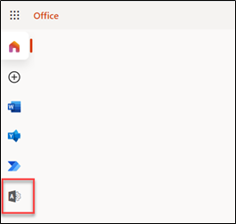
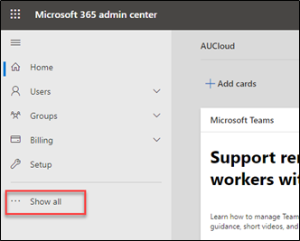
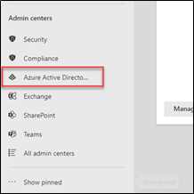
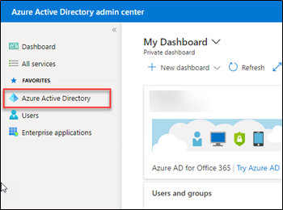
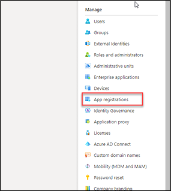
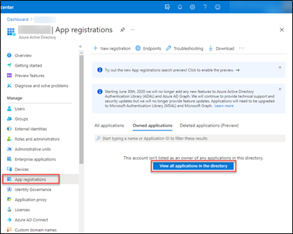
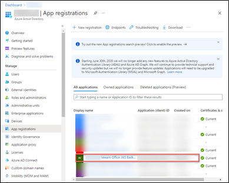
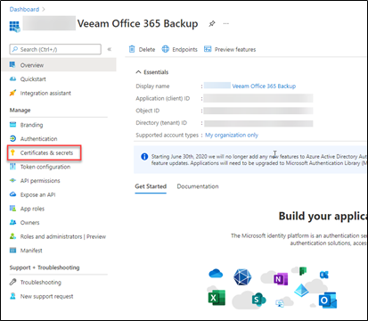
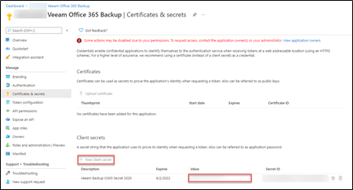

### Generating M365 Secrets

If you need to generate a new secret for your Veeam Backup for Office 365 account, simply follow the steps below:

1. Login to **Office.com** using your admin account and navigate to the **Admin Center**.

    

1. Within the Admin Center, Click on **Show all**

    

1. Click on **Azure Active Directory**
  
    

1. Within Azure Active Directory admin centre, click on **Azure Active Directory**
  
    

1. Click on **App registrations**

    

1. Click on **view all applications in the directory**

    

1. Click on the **Veeam Office 365 backup app**

    

1. Inside the app, click on **Certificates and Secrets**

    

1. Click on “**\+ new client secret”**. Once the new one is created, remove the expired one. The value is the new secret required to reconfigure the customer organisation.

    
