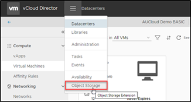

 
## Overview

Object storage is a data storage architecture that manages data as objects, as opposed to other storage architectures which manages data as a file hierarchy. Each object typically includes the data itself, an amount of metadata and a globally unique identifier which is stored within a bucket.

Buckets are containers for objects. You can have one or more buckets and control who has access to each bucket.

## Accessing Object Storage

1. S3 Object Storage can be accessed via a plug-in through VMware Cloud Director and is enabled by default. If you do not have access contact your Customer Success Manager, Sales Executive or AUCyber Support [support@aucyber.com.au](mailto:support@aucyber.com.au).

2. When the plug-in has been enabled, you will be able to access Object Storage and commence creating your buckets. Select **Object Storage** from the Main Menu.

      

3. You will be presented with the dashboard which displays an overall view of your object store including:

    - Total Buckets
    - Total Objects
    - Storage Used
    - Users

    

!!! note

    An AWS specific example on how to make this work using the aws command line tool:

1. Create an AWS credentials file (have your `access_key_id` and `secret_access_key` ready):

    ```bash
    aws configure --profile=aucloud
    ```

1. Test connectivity to the s3 bucket you created previously (assumed in this example to be `mybucket`, using the CSZ endpoint)

    ```bash
    aws --profile=aucloud --endpoint-url=https://vos.s3-sz101.australiacloud.com.au/api/v1/s3 s3 ls s3://mybucket
    ```


## Path vs Host based bucket access
Files can be accessed using s3, across two methods - host based and path based access.

For a bucket `bucket`, and a file `bar.txt` using path based access in AUCyber's **SSZ** environment. would have a path of:

`https://s3-sz201.australiacloud.com.au/api/v1/s3/bucket/bar.txt`

using host based access:

`https://bucket.s3-sz201.australiacloud.com.au/bar.txt`

Note that the result is that each bucket name is globally unique.

!!! warning "Restrictions on host based access"
    Currently **CSZ** does not support host based access.

