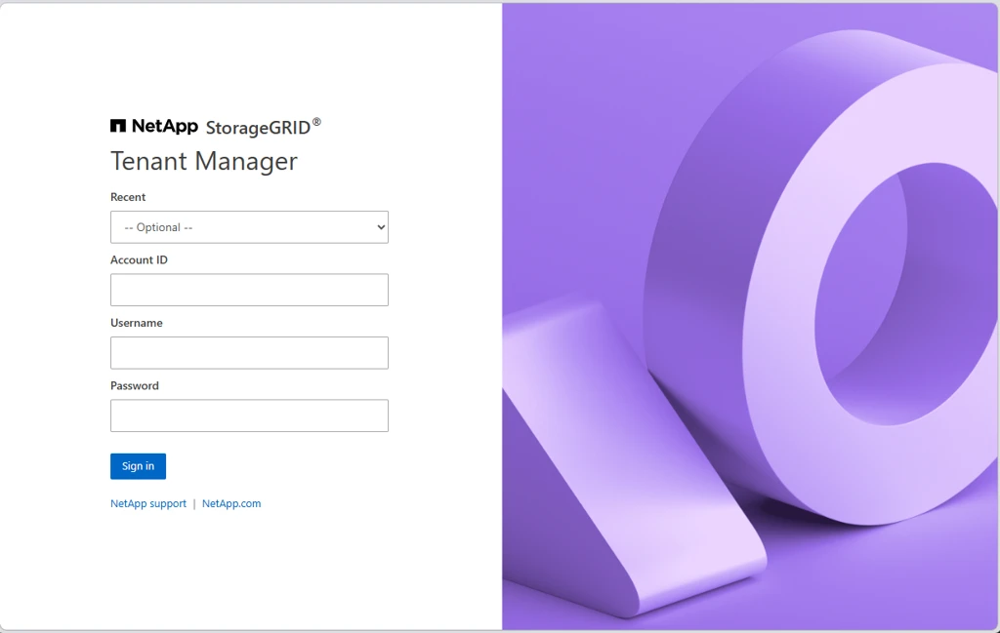
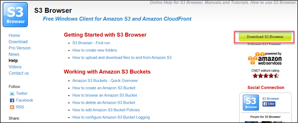
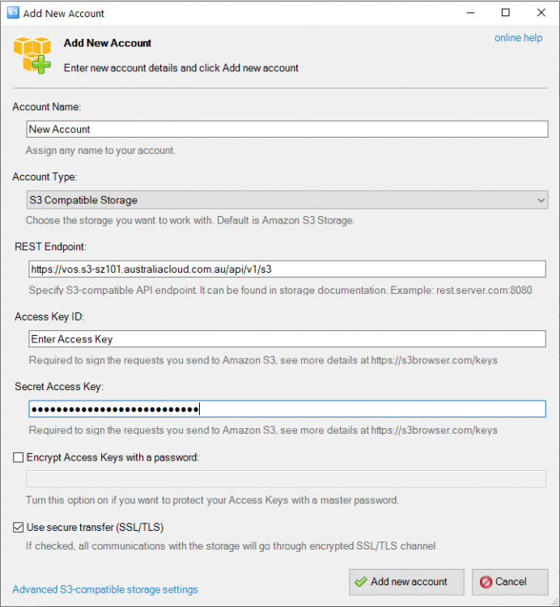
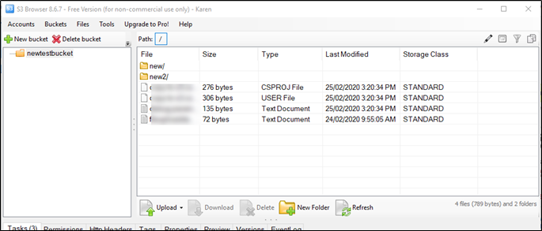

## Overview

Object storage is a data storage architecture that manages data as objects, as opposed to other storage architectures which manage data as a file hierarchy. Each object includes the data itself, an amount of metadata, and a globally unique identifier, and is stored within a bucket. Buckets are containers for objects. You can have one or more buckets and control who has access to each.

AUCyber object storage is provided by NetApp StorageGRID. There is a single S3 API endpoint, `https://s3.aucyber.com.au`, serving all sovereignty zones; the zone (CSZ or SSZ) is selected per bucket when the bucket is created. Both path-style (`https://s3.aucyber.com.au/<bucket>/<key>`) and host based (`https://<bucket>.s3.aucyber.com.au/<key>`) addressing are supported.

To use any S3 client you need:

- **Endpoint**: `https://s3.aucyber.com.au`
- **Access Key ID** and **Secret Access Key** - see [Security Credentials](./security_credentials.md)

## Web UI

Object storage is managed through the StorageGRID **Tenant Manager** at [https://s3-tenant.aucyber.com.au](https://s3-tenant.aucyber.com.au). Log in with the tenant ID and root credentials supplied by AUCyber. If you do not have these, contact your Customer Success Manager, Sales Executive or AUCyber Support [support@aucyber.com.au](mailto:support@aucyber.com.au).



From the Tenant Manager you can create and manage buckets, users and S3 access keys, and view a summary of your object store including total buckets, objects, storage used and users.

## AWS CLI

1. Configure a profile with your access key and secret key:

    ```bash
    aws configure --profile=aucloud
    ```

1. Use the `--endpoint-url` flag to target AUCyber object storage:

    ```bash
    # list your buckets
    aws --profile=aucloud --endpoint-url=https://s3.aucyber.com.au s3 ls

    # list objects in a bucket
    aws --profile=aucloud --endpoint-url=https://s3.aucyber.com.au s3 ls s3://mybucket

    # upload a file
    aws --profile=aucloud --endpoint-url=https://s3.aucyber.com.au s3 cp myfile.txt s3://mybucket/
    ```

## s5cmd

[s5cmd](https://github.com/peak/s5cmd) is a very fast, parallel S3 client. It reads credentials from the standard AWS environment variables or `~/.aws/credentials`, and takes the endpoint as a flag:

```bash
export AWS_ACCESS_KEY_ID=<access key id>
export AWS_SECRET_ACCESS_KEY=<secret access key>

# list your buckets
s5cmd --endpoint-url https://s3.aucyber.com.au ls

# upload a file
s5cmd --endpoint-url https://s3.aucyber.com.au cp myfile.txt s3://mybucket/
```

## Cyberduck

[Cyberduck](https://cyberduck.io/) is a graphical S3 client for Windows and macOS.

1. Click **Open Connection**.
1. Select **Amazon S3** from the drop-down.
1. Enter the connection details:
    - **Server**: `s3.aucyber.com.au`
    - **Port**: `443`
    - **Access Key ID**: your access key
    - **Secret Access Key**: your secret key
1. Click **Connect**.

## S3 Browser

[S3 Browser](https://s3browser.com/) is a graphical S3 client for Windows. The free version restricts upload and download to two concurrent connections; paid versions allow up to 10.

1. Navigate to [https://s3browser.com/](https://s3browser.com/) and download S3 Browser.

    

1. Add a new account with the following parameters:

    - **Account Name**: a name of your choice
    - **Account Type**: S3 Compatible Storage
    - **REST Endpoint**: `s3.aucyber.com.au`
    - **Access Key ID**: your access key
    - **Secret Access Key**: your secret key
    - **Signature Version**: Signature V4
    - **Addressing Model**: Path Style
    - Click **Add new account**

    

1. You can now manage your buckets - add, delete and download objects.

    
