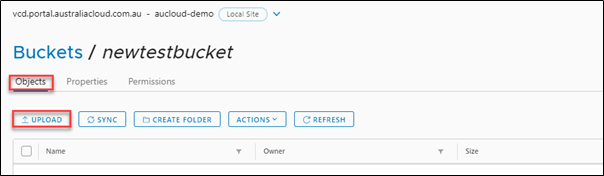

## Add an object to a bucket

1. To upload objects into the S3 bucket through the user interface, click on name of the bucket you want to upload files to. Under the **Objects** tab, click **UPLOAD**.

      

1. The upload wizard will open. Click **Select Objects** to upload.

      

1. Select the file or files you want to upload and click **Open**.

      

1. Confirm the upload and select UPLOAD. Additional objects can be selected at this point.

    

!!! note

    For Linux systems there are some comparable options available:

    - [rclone](https://rclone.org/)
    - [Cyberduck](https://cyberduck.io/)
    - [Minio client](https://min.io/download)
    - [AWS CLI v2](https://aws.amazon.com/cli/)