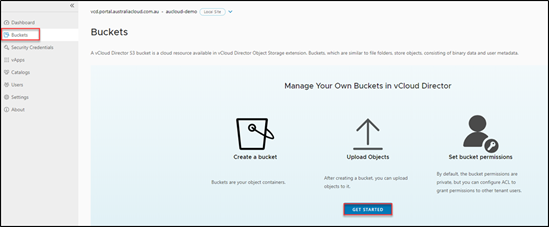
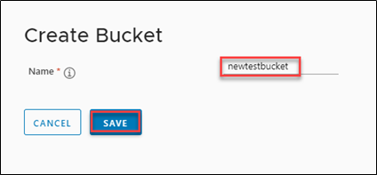
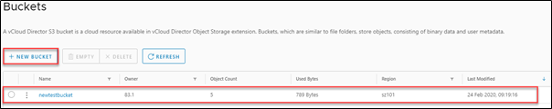

## Creating a Bucket

1. To begin, you will first need to create a bucket. Click on **Buckets** from the left-hand menu then click on **GET STARTED**.

      

1. Enter a name for your bucket. The name must comply with the validation rules:

    - Must be unique across all existing names.
    - Must comply with DNS naming conventions.  
    - Must be at least 3 and no more than 63 characters long.
    - Must be a series of one or more labels.  
             • Each label can contain lowercase letters, numbers and hyphens.  
             • Each label must start and end with a lowercase letter or a number.  
             • Adjacent labels are separated by a single period (.)  
    - Must not be formatted as an IP address (for example, 192.168.5.4).

    

1. Click **SAVE.** The bucket you have just created will now be displayed in your list of buckets.

1. To create additional buckets, click on **+NEW BUCKET** and follow the wizard to create as many buckets as you require.

    
