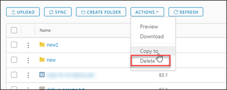

## Delete an object

1. To delete an object, click the check box of the object you want to delete.

    

1. Under **ACTIONS** select **Delete**.

    

1. Review the objects you want to delete and select **Delete**.

    

## Delete a bucket

1. To delete a bucket, click the ellipsis next to the bucket you want to delete.

    

1. Select **Delete**.

    

1. Confirm the deletion of the bucket you want to delete and select **Delete**.

    
