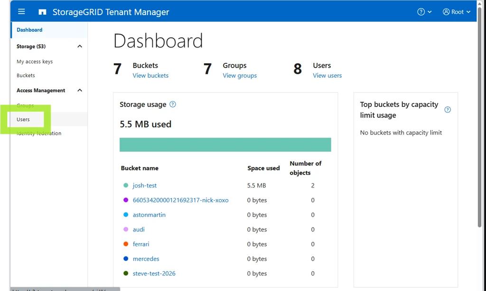
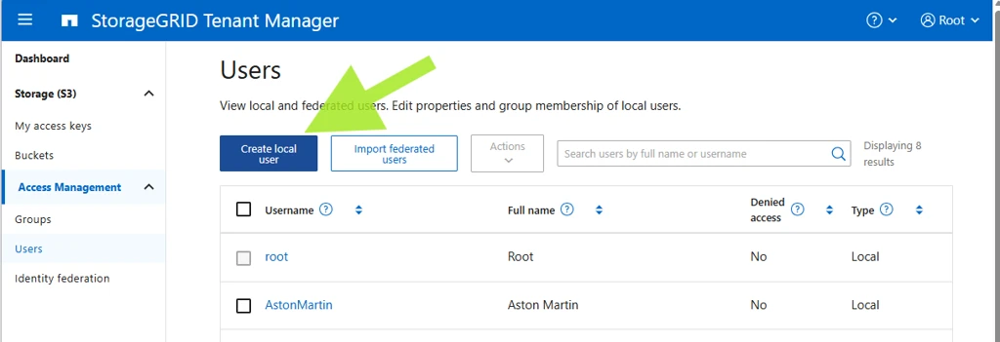
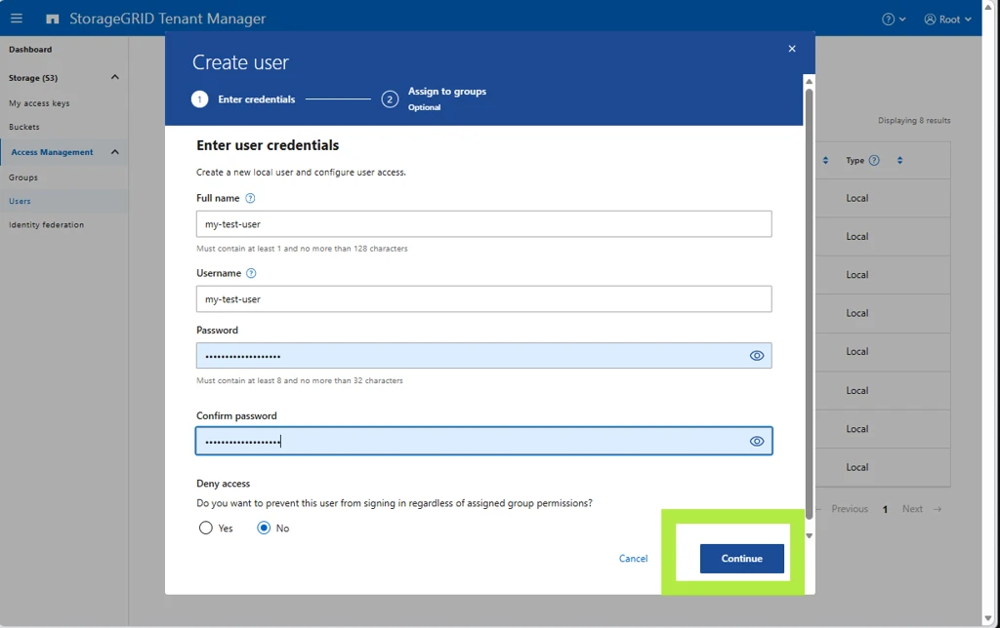
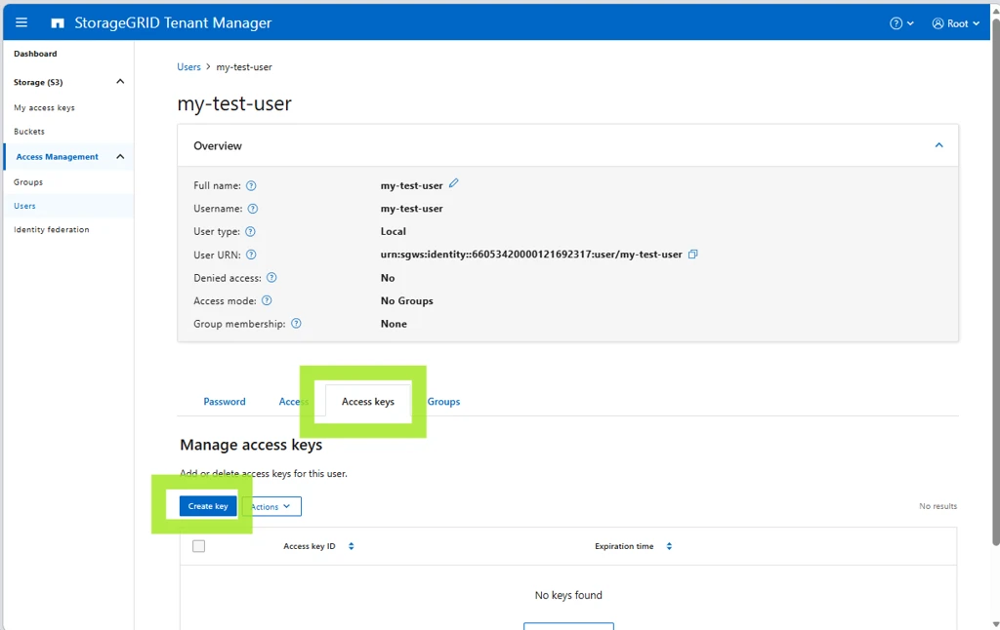
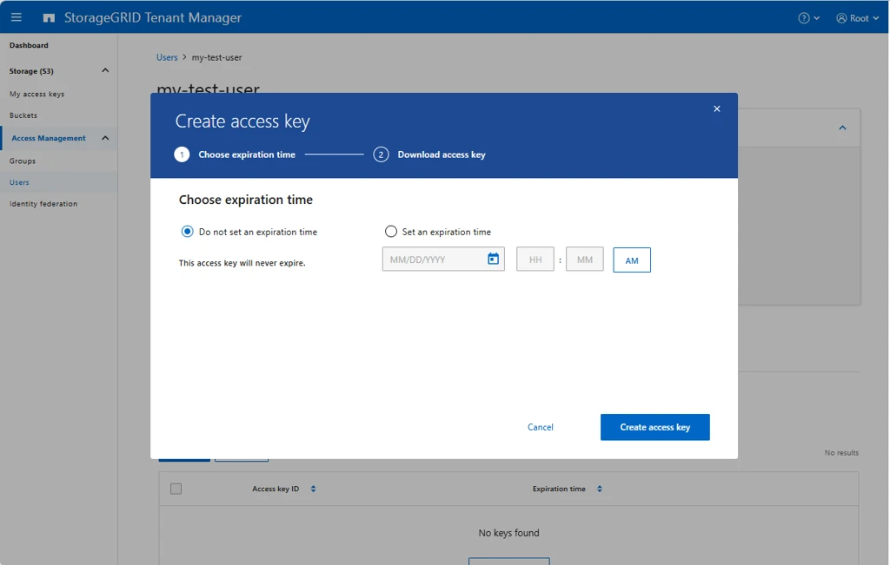
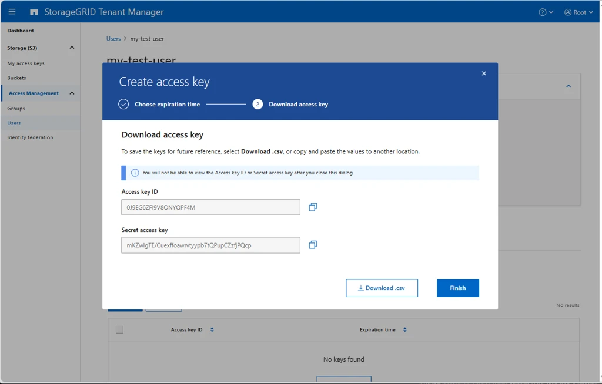
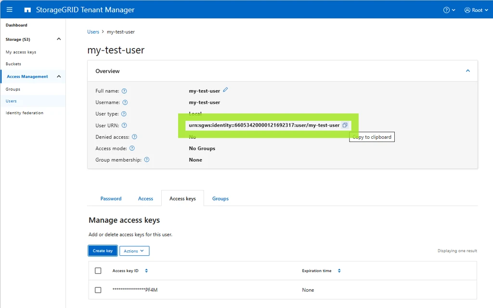
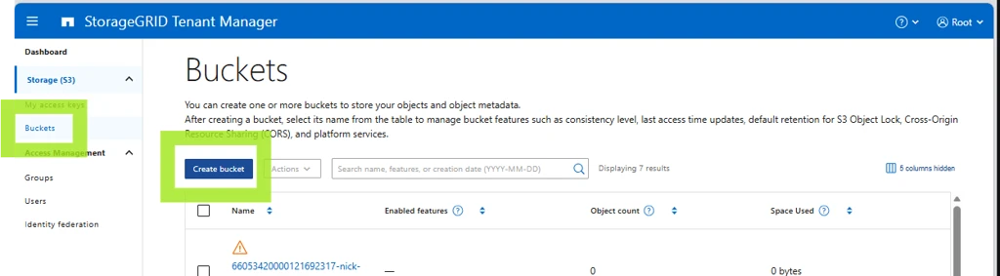
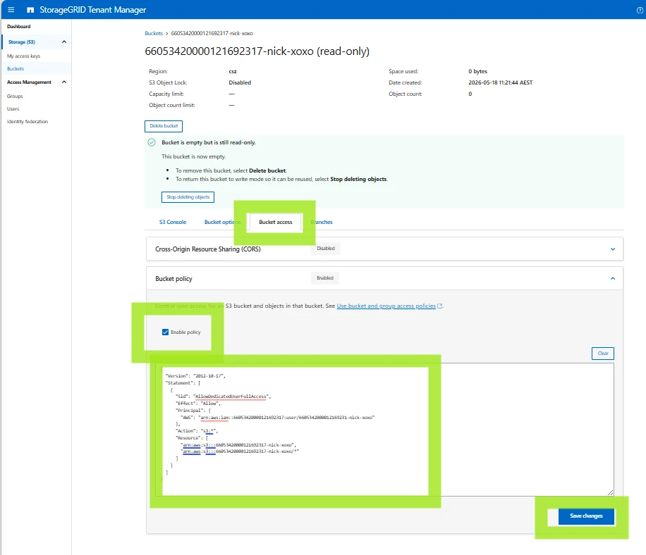

## Limiting bucket access to specific access keys

For the simplest use case, you can use your root or tenant-level access keys to access all buckets in your tenancy.

This page describes the scenario where you need specific keys to only have access to a specific bucket. You create a dedicated tenant user, generate access keys for that user, and attach a [bucket policy](./best_practices.md#use-bucket-policies) that grants only that user access to the bucket.

## Log in

Log in to the Tenant Manager at [https://s3-tenant.aucyber.com.au/](https://s3-tenant.aucyber.com.au/).

You will need your tenant ID and root access credentials as supplied by AUCyber. If you do not have these, please reach out to your Customer Success Manager for secure delivery.


## Create a user

1. Navigate to **Users**.

    

1. Create a **local user**.

    

    

1. There is no need to add the user to any groups.

## Create access keys for the user

1. On the user, create a set of S3 access keys.

    

1. Set an expiration time if desired. If this is possible, it is always recommended, to mitigate against future leaking of the key.

    

    !!! info
        **Be sure to copy and store your secret key securely.** It will not be available (even to AUCyber staff) after creation.

    

## Create the policy

On the user screen, get the user's URN. You will put this into the bucket policy to ensure only this user can access the bucket.



In a text editor, copy the policy below and update it with:

- The **Principal URN** (in this example `urn:sgws:identity::66053420000121692317:user/my-test-user`)
- The **bucket name** in the `Resource` section, in both lines (in this example `66053420000121692317-nick-xoxo`)

```json
{
  "Version": "2012-10-17",
  "Statement": [
    {
      "Sid": "AllowDedicatedUserFullAccess",
      "Effect": "Allow",
      "Principal": {
        "AWS": "urn:sgws:identity::66053420000121692317:user/my-test-user"
      },
      "Action": "s3:*",
      "Resource": [
        "arn:aws:s3:::66053420000121692317-nick-xoxo",
        "arn:aws:s3:::66053420000121692317-nick-xoxo/*"
      ]
    }
  ]
}
```

It is a redundancy to include the bucket name in the policy when the policy applies only to this specific bucket anyway, but it is best practice to prevent accidental misconfiguration.

!!! note
    StorageGRID accepts either principal format - the StorageGRID-native form (`urn:sgws:identity::<tenant-id>:user/<name>`, used above) or the AWS-style form (`arn:aws:iam::<tenant-id>:user/<name>`, emitted by the PowerShell script below). Both are valid; use whichever you prefer, just be consistent.

## Create the bucket

1. Create the bucket.

    

1. Set the policy you created above on the bucket and save.

    

Now you should be able to access this bucket (and this bucket only) with the access keys.

## PowerShell script to do all this automatically

This PowerShell script will prompt for the tenant ID, root password and bucket name and do all of the above.

!!! warning
    This code comes with no warranty nor implication of fitness for purpose, and it is the responsibility of users to check the code for correctness prior to running.

```powershell
<#
.SYNOPSIS
  Provision a NetApp StorageGRID S3 bucket with a dedicated tenant user,
  access keys, and a bucket policy granting that user full access.

.DESCRIPTION
  Idempotent. Safe to re-run; existing bucket/user are reused. Access keys
  are always newly generated (StorageGRID does not return existing secrets).

  Workflow:
    1. Authenticate to the Tenant Management API as the tenant root user.
    2. Create the bucket (if it doesn't exist).
    3. Create a tenant S3 user named after the bucket (if it doesn't exist).
    4. Generate a fresh S3 access key pair for that user.
    5. Apply a bucket policy granting that user full s3:* on the bucket.
    6. Print the access key / secret key.

.PARAMETER AdminEndpoint
  FQDN of the StorageGRID Admin/Management endpoint.
  Example: admin.storagegrid.example.com

.PARAMETER TenantId
  20-digit numeric StorageGRID tenant account ID.

.PARAMETER Username
  Tenant user used to authenticate. Defaults to "root".

.PARAMETER Password
  Password for the tenant user. Plain string for convenience; switch to
  SecureString if calling non-interactively from secret stores.

.PARAMETER BucketName
  Single S3 bucket to create. Also used as the new tenant user name (lowercased).

.PARAMETER BucketNames
  Comma-separated list of bucket names to create in bulk. Each bucket gets its
  own dedicated tenant user (named after the bucket, lowercased) and key pair.
  Mutually exclusive with -BucketName; if both are supplied, BucketNames wins.

.PARAMETER Region
  S3 region for the bucket. Defaults to "us-east-1".

.PARAMETER SkipCertCheck
  Skip TLS certificate validation. Use only for self-signed admin certs.

.EXAMPLE
  .\New-StorageGridBucketWithUser.ps1 `
      -AdminEndpoint admin.sg.example.com `
      -TenantId 12345678901234567890 `
      -Password 'changeme' `
      -BucketName project-alpha `
      -SkipCertCheck

.EXAMPLE
  .\New-StorageGridBucketWithUser.ps1 `
      -AdminEndpoint admin.sg.example.com `
      -TenantId 12345678901234567890 `
      -Password 'changeme' `
      -BucketNames 'alpha,beta,gamma' `
      -SkipCertCheck
#>

[CmdletBinding()]
param(
    [string]$AdminEndpoint,
    [string]$TenantId,
    [string]$Username,
    [string]$Password,
    [string]$BucketName,
    [string]$BucketNames,
    [string]$Region,
    [switch]$SkipCertCheck
)

$ErrorActionPreference = "Stop"

# ---------------------------------------------------------------------------
# Interactive prompts (with default hints)
# ---------------------------------------------------------------------------
function Read-WithDefault {
    param(
        [Parameter(Mandatory)][string]$Prompt,
        [string]$Default,
        [switch]$Secret,
        [switch]$Required
    )
    while ($true) {
        $label = if ($Default) { "$Prompt [$Default]" } else { $Prompt }
        if ($Secret) {
            $secure = Read-Host -Prompt $label -AsSecureString
            $bstr   = [System.Runtime.InteropServices.Marshal]::SecureStringToBSTR($secure)
            try {
                $value = [System.Runtime.InteropServices.Marshal]::PtrToStringBSTR($bstr)
            } finally {
                [System.Runtime.InteropServices.Marshal]::ZeroFreeBSTR($bstr)
            }
        } else {
            $value = Read-Host -Prompt $label
        }
        if ([string]::IsNullOrWhiteSpace($value)) { $value = $Default }
        if ($Required -and [string]::IsNullOrWhiteSpace($value)) {
            Write-Host "    value required" -ForegroundColor Yellow
            continue
        }
        return $value
    }
}

if ([string]::IsNullOrWhiteSpace($AdminEndpoint)) {
    $AdminEndpoint = Read-WithDefault -Prompt "AdminEndpoint" -Default "s3-tenant.aucyber.com.au" -Required
}
if ([string]::IsNullOrWhiteSpace($TenantId)) {
    $TenantId = Read-WithDefault -Prompt "TenantId" -Required
}
if ([string]::IsNullOrWhiteSpace($Username)) {
    $Username = Read-WithDefault -Prompt "Username" -Default "root" -Required
}
if ([string]::IsNullOrWhiteSpace($Password)) {
    $Password = Read-WithDefault -Prompt "Password" -Secret -Required
}
if ([string]::IsNullOrWhiteSpace($BucketNames) -and [string]::IsNullOrWhiteSpace($BucketName)) {
    $BucketNames = Read-WithDefault -Prompt "BucketName(s) (comma-separated for bulk)" -Required
}
if ([string]::IsNullOrWhiteSpace($Region)) {
    $Region = Read-WithDefault -Prompt "Region" -Default "csz" -Required
}

# Resolve the bucket list (BucketNames takes precedence)
if (-not [string]::IsNullOrWhiteSpace($BucketNames)) {
    $BucketList = $BucketNames -split ',' |
        ForEach-Object { $_.Trim() } |
        Where-Object { $_ }
} else {
    $BucketList = @($BucketName)
}
if ($BucketList.Count -eq 0) {
    throw "No bucket names supplied."
}

# ---------------------------------------------------------------------------
# TLS / certificate handling
# ---------------------------------------------------------------------------
$invokeExtra = @{}
if ($SkipCertCheck) {
    if ($PSVersionTable.PSVersion.Major -ge 6) {
        $invokeExtra["SkipCertificateCheck"] = $true
    } else {
        # PS 5.1 fallback: globally trust all certs for this session
        if (-not ("TrustAllCertsPolicy" -as [type])) {
            Add-Type @"
using System.Net;
using System.Security.Cryptography.X509Certificates;
public class TrustAllCertsPolicy : ICertificatePolicy {
    public bool CheckValidationResult(ServicePoint sp, X509Certificate cert,
        WebRequest req, int prob) { return true; }
}
"@
        }
        [System.Net.ServicePointManager]::CertificatePolicy = New-Object TrustAllCertsPolicy
        [System.Net.ServicePointManager]::SecurityProtocol  = `
            [System.Net.SecurityProtocolType]::Tls12
    }
}

$BaseUri = "https://$AdminEndpoint/api/v3"

# ---------------------------------------------------------------------------
# Authenticate
# ---------------------------------------------------------------------------
Write-Host "[*] Authenticating to $AdminEndpoint (tenant=$TenantId, user=$Username)"
$authBody = @{
    accountId = $TenantId
    username  = $Username
    password  = $Password
    cookie    = $false
    csrfToken = $false
} | ConvertTo-Json

$authResp = Invoke-RestMethod -Method Post `
    -Uri "$BaseUri/authorize" `
    -Body $authBody `
    -ContentType "application/json" `
    @invokeExtra

$Token   = $authResp.data
$Headers = @{ Authorization = "Bearer $Token" }

# ---------------------------------------------------------------------------
# Helper for authenticated API calls
# ---------------------------------------------------------------------------
function Invoke-SgApi {
    param(
        [Parameter(Mandatory)][string]$Method,
        [Parameter(Mandatory)][string]$Path,
        $Body = $null
    )
    $params = @{
        Method      = $Method
        Uri         = "$BaseUri$Path"
        Headers     = $Headers
        ContentType = "application/json"
    }
    foreach ($k in $invokeExtra.Keys) { $params[$k] = $invokeExtra[$k] }
    if ($null -ne $Body) {
        $params["Body"] = ($Body | ConvertTo-Json -Depth 20 -Compress)
    }
    try {
        return Invoke-RestMethod @params
    } catch {
        $msg = $_.Exception.Message
        if ($_.ErrorDetails -and $_.ErrorDetails.Message) {
            $msg += " | $($_.ErrorDetails.Message)"
        }
        throw "API $Method $Path failed: $msg"
    }
}

# ---------------------------------------------------------------------------
# Cache the user list once; we'll refresh after creating new users.
# ---------------------------------------------------------------------------
$usersCache = Invoke-SgApi -Method GET -Path "/org/users?limit=1000"

$Results = New-Object System.Collections.Generic.List[object]

foreach ($RawBucket in $BucketList) {
    # StorageGRID/S3 requires bucket names to match [a-z0-9-.]; lowercase to comply.
    $Bucket        = $RawBucket.ToLowerInvariant()
    $NewUserShort  = $Bucket
    $NewUserUnique = "user/$NewUserShort"
    if ($Bucket -ne $RawBucket) {
        Write-Host "    note: '$RawBucket' lowercased to '$Bucket' for S3 compliance"
    }

    Write-Host ""
    Write-Host "=== Processing bucket '$Bucket' (user '$NewUserShort') ==="

    # -----------------------------------------------------------------------
    # 1. Bucket (idempotent)
    # -----------------------------------------------------------------------
    Write-Host "[*] Ensuring bucket '$Bucket' exists"
    $buckets = Invoke-SgApi -Method GET -Path "/org/containers"
    $bucketExists = $false
    if ($buckets.data) {
        $bucketExists = @($buckets.data | Where-Object { $_.name -eq $Bucket }).Count -gt 0
    }
    if ($bucketExists) {
        Write-Host "    bucket already exists"
    } else {
        Invoke-SgApi -Method POST -Path "/org/containers" `
            -Body @{ name = $Bucket; region = $Region } | Out-Null
        Write-Host "    bucket created"
    }

    # -----------------------------------------------------------------------
    # 2. Tenant user (idempotent)
    # -----------------------------------------------------------------------
    Write-Host "[*] Ensuring tenant user '$NewUserShort' exists"
    $existingUser = $null
    if ($usersCache.data) {
        $existingUser = $usersCache.data | Where-Object { $_.uniqueName -eq $NewUserUnique } | Select-Object -First 1
    }

    if ($existingUser) {
        $UserId = $existingUser.id
        Write-Host "    user already exists (id=$UserId)"
    } else {
        $createResp = Invoke-SgApi -Method POST -Path "/org/users" -Body @{
            fullName   = $NewUserShort
            uniqueName = $NewUserUnique
            memberOf   = @()
            disable    = $false
        }
        $UserId = $createResp.data.id
        Write-Host "    user created (id=$UserId)"
    }

    # -----------------------------------------------------------------------
    # 3. Generate S3 access keys (always issues a new pair)
    # -----------------------------------------------------------------------
    Write-Host "[*] Generating S3 access keys for $NewUserShort"
    $keyResp = Invoke-SgApi -Method POST `
        -Path "/org/users/$UserId/s3-access-keys" `
        -Body @{ expires = $null }

    $AccessKey = $keyResp.data.accessKey
    $SecretKey = $keyResp.data.secretAccessKey

    if (-not $AccessKey -or -not $SecretKey) {
        throw "Did not receive access key / secret key from StorageGRID for $NewUserShort."
    }

    # -----------------------------------------------------------------------
    # 4. Bucket policy
    # -----------------------------------------------------------------------
    Write-Host "[*] Applying bucket policy"
    $policyObj = [ordered]@{
        Version   = "2012-10-17"
        Statement = @(
            [ordered]@{
                Sid       = "AllowDedicatedUserFullAccess"
                Effect    = "Allow"
                Principal = @{ AWS = "arn:aws:iam::${TenantId}:user/$NewUserShort" }
                Action    = "s3:*"
                Resource  = @(
                    "arn:aws:s3:::$Bucket",
                    "arn:aws:s3:::$Bucket/*"
                )
            }
        )
    }
    Invoke-SgApi -Method PUT `
        -Path "/org/containers/$Bucket/policy" `
        -Body @{ policy = $policyObj } | Out-Null
    Write-Host "    policy applied"

    $Results.Add([pscustomobject]@{
        Bucket    = $Bucket
        Username  = $NewUserShort
        UserId    = $UserId
        AccessKey = $AccessKey
        SecretKey = $SecretKey
    })
}

# ---------------------------------------------------------------------------
# Output
# ---------------------------------------------------------------------------
Write-Host ""
Write-Host "============================================================"
Write-Host "  Admin endpoint : $AdminEndpoint"
Write-Host "  Tenant ID      : $TenantId"
Write-Host "  Region         : $Region"
Write-Host "  Buckets        : $($Results.Count)"
Write-Host "============================================================"
Write-Host ""
$Results | Format-Table Bucket, Username, AccessKey, SecretKey -AutoSize -Wrap | Out-Host
Write-Host ""
Write-Host "Capture the secret keys now. StorageGRID will not return them again."

# Emit the result objects to the pipeline so they can be captured / exported.
$Results
```

Example run:

```bash
PS C:\Users\NickDoyle\ws\s3> Get-Content .\s3.ps1 -Raw | Invoke-Expression
AdminEndpoint [s3-tenant.aucyber.com.au]:
TenantId: 66053420000121692317
Username [root]:
Password: ***************
BucketName: 66053420000121692317-nick-xoxo
Region [csz]:
[*] Authenticating to s3-tenant.aucyber.com.au (tenant=66053420000121692317, user=root)
[*] Ensuring bucket '66053420000121692317-nick-xoxo' exists
    bucket created
[*] Ensuring tenant user '66053420000121692317-nick-xoxo' exists
    user created (id=90c59fa5-8d93-4add-a730-f7f7882e887a)
[*] Generating S3 access keys for 66053420000121692317-nick-xoxo
[*] Applying bucket policy
    policy applied

============================================================
  Admin endpoint : s3-tenant.aucyber.com.au
  Tenant ID      : 66053420000121692317
  Bucket         : 66053420000121692317-nick-xoxo  (region=csz)
  S3 User        : 66053420000121692317-nick-xoxo  (id=90c59fa5-8d93-4add-a730-f7f7882e887a)
  Access Key ID  : xxx
  Secret Key     : yyy
============================================================
Capture the secret key now. StorageGRID will not return it again.
```
