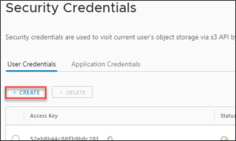
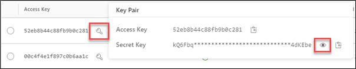
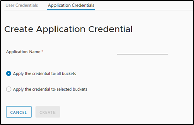

## Security Credentials

1. Security Credentials are required to access buckets programmatically [via S3 API's.](./accessing_from_an_s3browser.md)

    [The AUCloud S3 API endpoints](../reference_urls.md#s3-storage-endpoints)

1. To create user credentials, click **+CREATE**.

    

1. To view the Access and Secret Key, click on the key symbol next to the access key to view the key pair.

1. Click on the 'eye' symbol to reveal the complete Secret Key.

    

1. Application credentials are stored within an application and created using the same process as for user Credentials.

1. You can select the Application Credential to apply to all buckets or selected buckets.

    