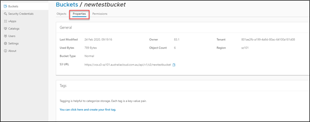
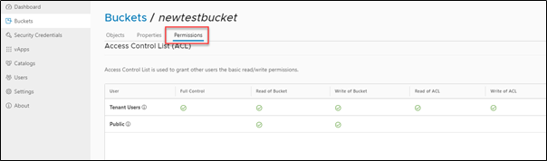
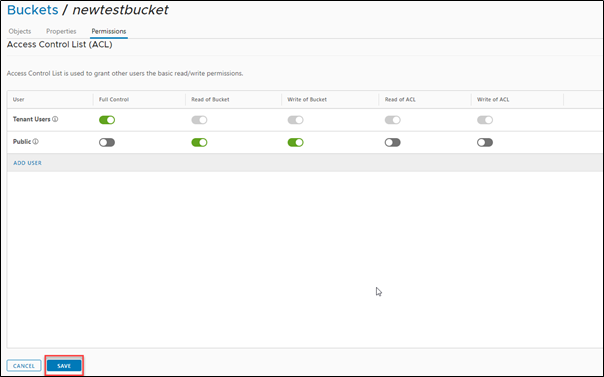

## View properties and manage permissions

!!! warning

    Customers should be careful as to what data they are exposing to the internet.

1. To view the properties of a bucket, click on the **Properties** tab after going to your selected bucket.

      

1. To view selected permissions, click on the **Permissions** tab in your selected bucket.

      

1. Permission can be edited by clicking on the EDIT button.

1. Access controls can be adjusted, and new users can be added.

1. Click **SAVE** to save the changes.

    