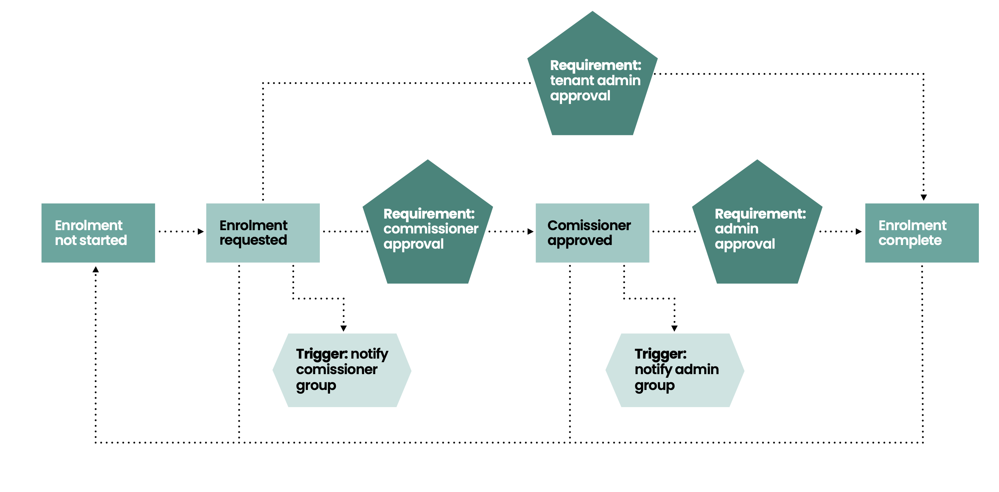

## Overview
SKAP negotiates keys between devices in a close network or network or networks[^1].
In order for a device to be registered in the system it needs to attempt to enroll, then be approved into the network.

The roles a device can play in the registration process are dictated by role provided within the QuantumCloud™ console.

The console is a web interface where users an devices can be managed. Console URLs are client specific and are provided on service provisioning.

When a device is registered a (tenant) administrator approves it into the network. At this point the device can begin key negotiation with other devices within the network.

## Registration key options
In order to register a device a provisioning a method must be chosen for provisioning the initial symmetric key. The settings below are configured within the [SDKs](./SDKs.md) or AUCloud provided applications.

### `QKEY`

A `QKEY` is a `AES-256` key which (within AUCloud's platform), is stored in a `FIPS 140-2 Level 3` HSM. This mechanism provides the highest security option. Clients are provided with a `qkey_id` and a base 64 encoded `QKEY` for use with the SDKs.

This is combined with username a client's username and password to securely start the device registration process.

!!! info
    AUCloud can provide multiple options for the distribution of QKEYs depending on security requirements. Please contact [support](../../Platform_Overview/support/index.md) to organise `QKEY`s if required.

### `OTA_TLS`
`OTA_TLS` leverages the current TLS standard algorithms, combined with username and password.
The bootstrap key is then delivered over the wire to the device during registration.

!!! warning "Increased security risks"
    Over the wire registration with TLS exposes users to `harvest now; decrypt later` attacks.
    It should only be used for development environments

### `OTA_QUANTUM`
`OTA_QUANTUM` takes the same 'over the air' approach as as `OTA_TLS`

!!! warning "Increased security risks"
    Over the wire bootstrapping means that public key cryptography is used transiently

[^1]: Clients can peer two networks together, allowing communications across organisations in the Quantum Cloud platform.