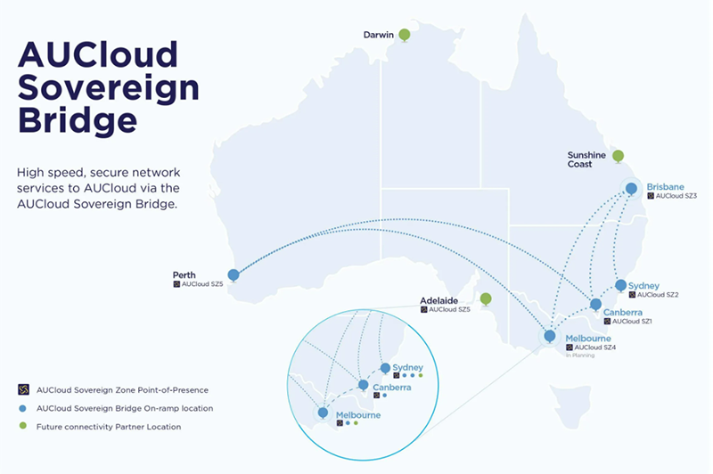

## Overview

AUCloud's Sovereign Bridge provides connectivity between physical and virtual resources within the data centre ecosystem throughout continental Australia.

Features include:

- High speed, low latency, and secure connectivity between physical and virtual resources and AUCloud services.
- Reduced network costs for high-speed transfer of large volumes of data.
- Dedicated connectivity paths that deliver data quickly and securely.
- Ability to scale as needed with high performance and guaranteed quality of service.

For more information, see: [AUCloud Sovereign Bridge](https://www.australiacloud.com.au/aucloud-sovereign-bridge/)